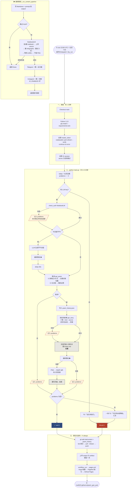

# 每日 daily-run 流程

**触发**：`.github/workflows/daily-run.yml`，cron `0 23 * * *`（UTC 23:00 = 北京 7:00；GitHub 高峰期实际延后 1–2.5 小时）。也可手动 dispatch，勾 `dry_run` 则跳过 NotebookLM / Telegram / Instagram，只生成文字并提交。

**Runner**：ubuntu-latest，Python 3.13，job 超时 30 分钟，权限 `contents: write`。

## 流程图

读图要点：

- 橙色方块是四个降级记录点，任一触发，结尾都走红色 `exit 1` 并发一条 Telegram 汇总；但**提交与发布照常执行**（`if: always()`），红色的一天仍然有页面上线。
- **「先落页面」在通用管线之前**：NotebookLM 那一整块无论怎么坏，当天的诗和考据已经在磁盘上等着被提交。
- 通用管线被节气和诗词共用；节气那次的产物只推送、不进 git、不进站点。
- 衍生一则（`get_tale`）由 `config.yaml` 的 `tale.enabled` 控制，目前关闭，图里未画。

## 一、准备（约 1 分钟）

| 步骤 | 做什么 | 失败时 |
|---|---|---|
| Checkout | 拉 main | 中止 |
| Setup Python + pip cache | cache key 按 `requirements.lock` | — |
| Install dependencies | `pip install -r requirements.lock`，精确版本 | 中止 |
| Restore NotebookLM auth | 从 secret `NOTEBOOKLM_MASTER_TOKEN` 还原 `~/.notebooklm/profiles/default/master_token.json`，执行 `notebooklm auth refresh --verify` 现场 mint 一份新 cookie | **不中止**（`continue-on-error`），交给 main.py 降级 |
| Restore Instagram session | 从 secret `IG_SESSION` 还原 `~/.instagram/session.json` | secret 为空则跳过 |

测试不在这一步跑——`tests.yml` 在代码 push / PR 时执行。

## 二、`python main.py`（约 3–5 分钟）

环境变量来自 secrets：`GROK_API_KEY` / `OPENAI_API_KEY`（Grok 优先）、`TELEGRAM_*`、`IG_*`。

### 0. 初始化

- `today = beijing_today()`——按 Asia/Shanghai 取日期，不是 runner 的 UTC
- 没有任何 LLM key → 发 Telegram「当日未执行」→ `exit 1`
- 读 `config/config.yaml`：模型、`max_completion_tokens`、`site.content_dir`、`tale.enabled`
- `problems = []`——全程收集降级项

### 1. NotebookLM 认证检测

`check_auth()` 失败 → 本次全部信息图跳过，记入 problems（附修复指引）。不中止。

### 2. 节气分支（仅节气日）

`sxtwl` 判断今天是否节气 → 是则 LLM 生成节气介绍、习俗、饮食、养生、信息图 prompt → 走通用管线 → 信息图未生成则记入 problems。节气内容目前不进站点、不进 git，只推 Telegram / Instagram。节气日且 NLM 可用时，随后 `sleep 30s` 避免限流。

### 3. 诗词分支

**3a. 取诗** `get_poem(today)`——两次 LLM 调用兜底：

1. system prompt 注入近 90 天已推诗词的强制排除列表（`data/poem_history.json`，git 管理），附精确的农历、节气事实，让模型判断今天是否有关联名篇
2. 无关联 → 第二次调用随机推荐应季经典

返回 title / author / dynasty / full_text / occasion / meaning / customs / infographic_prompt。校验通过即写入 history。返回 None → 记入 problems（含当前模型名）。

**3b. 背后的故事** `get_story(poem)`——第二次 LLM 调用，六类素材（作者轶事 / 本事与创作背景 / 时代背景 / 风土人情 / 民间传说 / 典故名物），每条 `text + kind（史实|传说|附会|存疑）+ source`。代码层强制：自称史实而无出处 → 降级存疑。失败 → None，记入 problems。

**3c. 先落页面**——`site/content/poems/<日期>-<诗题>/index.md`（Hugo leaf bundle）：frontmatter 含基本信息 + 六个 taxonomy 字段（authors, dynasties, occasions, categories, kinds, pivot_types）+ summary；正文 = 诗 → 赏析 → 相关风俗 → 背后的故事（每条末尾 `〔史实 · 《宋史》〕`）。此时无图。

**3d. 通用管线** → 拿到 PNG 路径。

**3e. 补图**——PNG → WebP（原尺寸、q85）存入同目录 `infographic.webp`，重写页面加上图。未拿到图且未主动跳过 → 记入 problems。

### 4. 通用管线 `_run_content_pipeline`（节气 / 诗词共用）

1. 生成 NotebookLM 用的 Markdown 到 `output/`，prompt 另存 `.prompt.txt`
2. NotebookLM：查找/创建 notebook → 上传 Markdown 为 source → 创建 infographic（最多 3 次重试，退避 10s/20s）→ 等待完成（超时 300s）→ 重命名 artifact → 下载 PNG。整段 try/except：任何异常 → 返回 None
3. Telegram：先发图，再发完整文案
4. Instagram：`IG_ENABLED` 时以图 + 文案发帖
5. 返回图片路径

### 5. 收尾

`problems` 非空 → 打印全部 → 一条 Telegram「今日流水线降级」汇总 → `exit 1`。为空 → `exit 0`。

## 三、提交与发布

| 步骤 | 做什么 |
|---|---|
| Commit generated content（`if: always()`） | `git add site/content data/poem_history.json`；无变化则跳过；有则以 `github-actions[bot]` 提交，`pull --rebase` 后 push 回当前分支。即使 pipeline 标红也执行 |
| Upload artifact（`if: always()`） | `output/` 打包（Markdown、prompt、原始 PNG），保留 7 天 |
| → `pages.yml` | 由 `workflow_run` 触发（无论 daily-run 绿红）：Hugo 构建 → `npx pagefind` → 部署到 GitHub Pages。不能用 `on: push`——GITHUB_TOKEN 的 push 不触发 push 事件 |

## 四、每次运行的产出

- **git**：一个 bundle 目录（`index.md` + `infographic.webp`）+ `poem_history.json` 一条记录
- **站点**：新诗页 + 六个索引维度自动更新 + 搜索索引
- **Telegram**：节气图文（如有）+ 诗词图文；有降级则再加一条汇总
- **Instagram**：同上图文（若启用）
- **Actions**：绿 = 完整一天；红 = 有降级，Telegram 里有原因

## 五、各环节失败后果

| 失败点 | 结果 |
|---|---|
| 依赖安装 / checkout | 当天无产出，run 红，无 Telegram（pipeline 未启动） |
| NLM 认证（step 或 check） | 有诗、有考据、有页面，无图；TG 汇总；红 |
| 取诗 | 当天无诗词页；TG 汇总；红 |
| 故事 | 有诗页无故事节；TG 汇总；红 |
| NLM 生成 / 超时 / 异常 | 页面无图；TG 汇总；红 |
| Telegram / IG 发送 | 只打日志，不计入降级 |
| LLM key 缺失 | TG 通知；红 |

## 六、维护操作

- **换模型**：改 `config/config.yaml` 的 `openai.model`；换服务商则调整 secrets（Grok 优先于 OpenAI）
- **升级依赖**：按 `requirements.lock` 头部注释重新生成，然后 dispatch 一次 `dry_run`
- **NotebookLM master token 失效**：本地 `notebooklm login --master-token --account <邮箱>`，然后 `base64 -i ~/.notebooklm/profiles/default/master_token.json | gh secret set NOTEBOOKLM_MASTER_TOKEN`
- **回补某首诗**：本地 `python main.py --poem 诗题 --no-nlm --no-ig`，提交生成的目录
- **调 prompt**：dispatch 勾 `dry_run`，看提交回来的页面，不打扰 Telegram / Instagram
