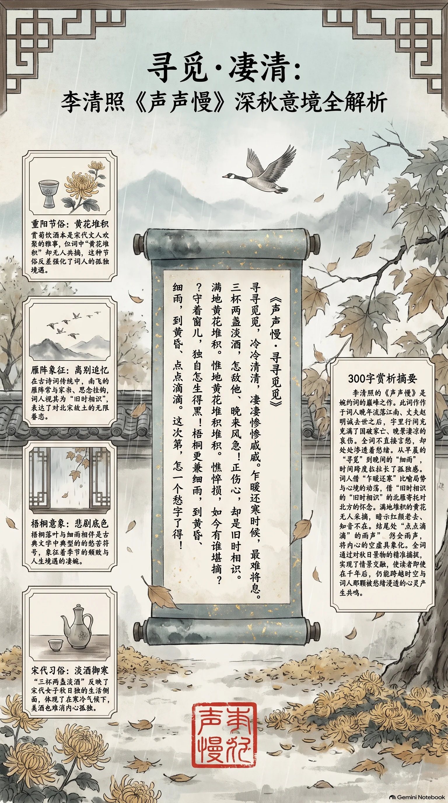

**宋·李清照** · 秋日闺思

## 诗词全文

寻寻觅觅，冷冷清清，凄凄惨惨戚戚。乍暖还寒时候，最难将息。三杯两盏淡酒，怎敌他、晚来风急！雁过也，正伤心，却是旧时相识。满地黄花堆积。憔悴损，如今有谁堪摘？守着窗儿，独自怎生得黑！梧桐更兼细雨，到黄昏、点点滴滴。这次第，怎一个愁字了得！

## 赏析

李清照的《声声慢》以细腻笔触描绘深秋时节的孤寂与愁绪。开篇连用叠词“寻寻觅觅，冷冷清清，凄凄惨惨戚戚”，生动刻画出词人内心空虚与悲凉。时值乍暖还寒，饮酒难敌风急，北雁南飞勾起旧日相思。庭院黄花堆积却无人共摘，窗前独坐难熬长夜，梧桐细雨更添凄切。全词层层递进，将个人身世之感与季节变化融为一体，展现了婉约词派的极致。赏析中可注意其叠词运用与意象叠加，体现宋词在情感表达上的精妙。读者可从中感受到秋风秋雨下的心灵共鸣，理解古代女性词人的细腻内心世界。

## 相关风俗

- 重阳前后赏菊饮酒是宋代文人雅事，李清照词中黄花堆积暗含对节俗的呼应，表达孤独而非欢聚。
- 秋季雁阵南飞在古诗词中常喻离别与思念，词人借此意象抒发对往昔的追忆，符合宋代文人秋思传统。
- 梧桐细雨象征愁苦，宋代文人常以梧桐为秋雨意象，体现季节变化与内心情感的交织。
- 淡酒御寒是宋代秋日常见习俗，词中“三杯两盏”反映女子独酌的无奈，折射出时代女性生活侧面。

## 背后的故事

> 李清照晚年流寓江南，丈夫赵明诚已逝，此词以连绵叠字状写秋闺孤寂，背景正值南渡后家国双亡，词中淡酒、黄花、梧桐细雨，皆为亲历之景，其《金石录后序》可作最直接注脚。

### 作者轶事

- 李清照十八岁嫁赵明诚，夫妇共同搜集金石书画，夜间校勘古籍，常以茶赌酒为乐。靖康之变后，赵明诚南渡病逝，清照独身辗转杭州、台州等地，晚景凄凉。《宋史·李清照传》仅寥寥数语，其自撰《金石录后序》详述这段聚散。 〔史实 · 《金石录后序》〕

### 本事与创作背景

- 此词不见于清照生前自编集，首见于南宋人编《草堂诗馀》。具体写作年份与地点无确切记载，学者多据“旧时相识”“黄花堆积”等句，推测作于丈夫去世后流寓江南时期，然缺乏直接文献佐证。 〔存疑〕

### 时代背景

- 靖康二年汴京失守，宋室南渡，士大夫仓皇渡江。清照随夫南奔，途中金石文物散佚殆尽。词中“晚来风急”与“点点滴滴”，既写实秋寒，也隐含国破家亡后无所依傍的流离感，与同时期南渡词人如朱敦儒、张元幹心境相近。 〔史实 · 《宋史·高宗本纪》〕

### 风土人情

- 重阳前后，江南闺阁多以菊花浸酒或簪戴。清照词中“满地黄花堆积”正写重阳后残菊无人采摘的景象，暗合当时“九日饮菊酒、插茱萸”的习俗。词中“三杯两盏淡酒”亦反映南宋士大夫家日常用酒抵御晚秋风寒的习惯。 〔史实 · 《东京梦华录·卷八》〕

### 典故与名物

- 雁过“旧时相识”，用汉苏武雁足传书典故。清照借北雁南来，暗指自己与北方故土及亡夫的音信已绝。梧桐细雨则化用白居易《长恨歌》“秋雨梧桐叶落时”，后世戏曲常以此句渲染离愁。 〔史实 · 《汉书·苏武传》〕
