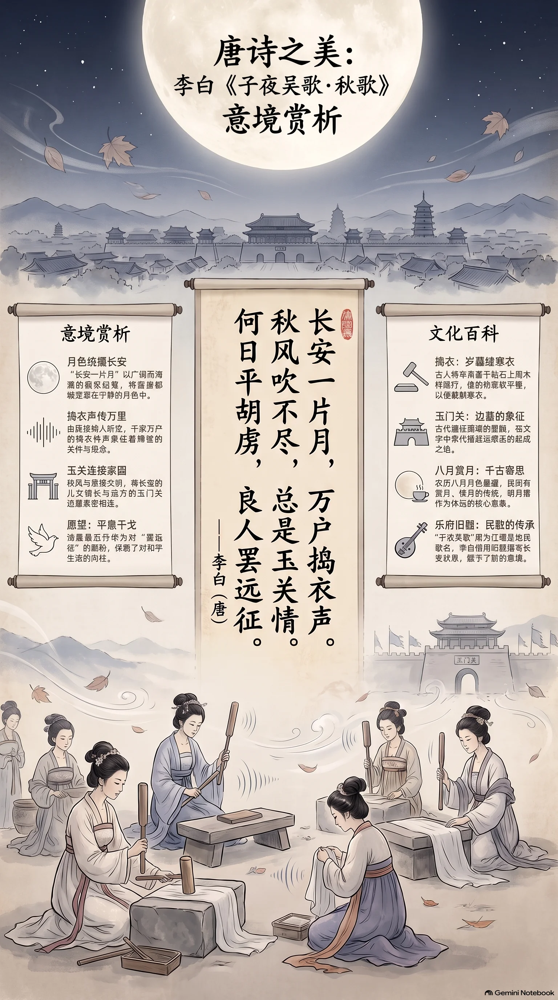

**唐·李白** · 初秋月夜，怀人盼归

## 诗词全文

长安一片月，万户捣衣声。
秋风吹不尽，总是玉关情。
何日平胡虏，良人罢远征。

## 赏析

农历八月初，暑气渐收，夜月愈显清澈，读李白这首《子夜吴歌·秋歌》正合时令。开篇“长安一片月”以一个辽阔而宁静的月夜笼罩全城；紧接着“万户捣衣声”由视觉转入听觉，家家为远行亲人赶制寒衣的杵声，令静夜有了绵密的人间温度。“秋风吹不尽”既写自然界不断的秋风，也写绵延不绝的思念；“总是玉关情”则将长安闺中人的牵挂，遥遥送往边塞玉门关一带。末二句没有停留于个人离愁，而是发出“何日平胡虏，良人罢远征”的共同愿望：唯有边患平息，亲人才能归家。全诗语言极为明白，却善用月、风、捣衣声等意象，把秋凉、思妇之情与反对无休止征战的愿望融为一体。所谓“子夜吴歌”，原本是江南吴地民歌调名，李白借旧题写长安秋思，也显示了乐府诗从民间声调中汲取深情的传统。

## 相关风俗

- 古人入秋后常“捣衣”，即将洗净的布帛放在砧石上用杵反复捶打，使织物柔软平整，便于裁制冬衣。
- “玉关”通常指玉门关，是古代通往西域的重要关隘。诗词中常以它代指遥远而艰苦的边塞地区。
- 农历八月月色渐盛，民间自古有赏月、候月与寄思传统。明月跨越山河，因而常成为怀远诗的核心意象。
- 乐府本是管理音乐的官署名称，后来也指可配乐歌唱的诗歌。李白常借乐府旧题，写出鲜明而自由的新意境。

## 背后的故事

> 这首六句小诗最耐人寻味处，在于它把长安的“万户捣衣”与遥远的玉门关缝在同一轮秋月下。捣衣本是妇女整治秋衣的家常声响，经李白一写，竟成为帝国边塞战争在都城民间留下的回声；“良人”二字，又使宏大的征戍落回一个家庭的盼归。

### 作者轶事

- 李白并非一开始便是宫廷诗人。《新唐书》称他“喜纵横术，击剑，为任侠，轻财好施”，青年时即带着游侠式的自负漫游蜀中、吴越与荆楚。这种既向往功名、又厌恶拘束的性格，使他笔下的征人并不只是边功的装饰，而常带着对久役、离散的敏感；《秋歌》末句的“罢远征”，正比一般边塞颂更近人情。 〔史实 · 《新唐书·李白传》〕
- 李白在《与韩荆州书》中自陈“十五好剑术”，又说自己“五岳寻仙不辞远，一生好入名山游”。这类自我塑造并非纯粹隐士姿态：他一面经营干谒与仕进，一面把漫游、任侠和神仙想象织成个人形象。写《子夜吴歌》时，他能把长安闺中人和玉关戍卒并置，正显示其地理想象跨越都会、江南旧调与西北边塞。 〔史实 · 《李太白集·卷二十六·与韩荆州书》〕

### 本事与创作背景

- 《子夜吴歌》共春、夏、秋、冬四首，今本《秋歌》题下没有作年、作地、受赠者或序文，不能确指为李白亲历某次战事、写给某位征人妻子的作品。它更像一次高度成功的乐府拟作：先用“长安”定下现实的都市坐标，再以“玉关”拉开万里征戍的距离，最后收束为普遍的盼归之问。 〔史实 · 《李太白集·卷六·子夜吴歌》〕
- “子夜”本属南朝清商曲中的吴声旧调，原来多写男女相思和四时节物。李白保留“四时歌”的框架，却把江南民歌的私语移到唐代首都：秋风、明月、砧声原是闺阁听觉，玉关、胡虏、远征则是边塞词汇。两种传统在六句中相撞，使这首诗既有吴歌的婉转，也有盛唐边患投下的阴影。 〔传说 · 《乐府诗集·卷四十四·清商曲辞一》〕

### 时代背景

- 唐人所谓“胡虏”，并非严格指某一族名，而是中原诗文对边境敌对势力的笼统称呼。开元、天宝间，唐廷在河西、陇右等地长期与吐蕃及诸部周旋，石堡城等地的攻守尤其惨烈。诗不必逐句落实为某次战役，却能借“平胡虏”说出普通家庭最朴素的愿望：战争结束，戍人不再远行。 〔史实 · 《旧唐书·吐蕃传》〕
- “万户”不宜坐实为精确户数，而是以夸张写长安夜色中连片的生活声响。唐都城实行坊市制与夜禁，居民夜间多在封闭坊内起居；秋夜风声较静，木杵落在砧石上的节奏便格外清晰。李白不写宫阙、酒楼，而让月光照见无数普通院落，形成一种由家常劳作汇成的都市声景。 〔史实 · 《唐律疏议·卷二十六·杂律》〕

### 风土人情

- “捣衣”是把洗濯后的丝、麻织物置于砧石或木砧上，用杵反复捶打，使其平整柔软的工序；秋凉将至，尤须赶制、整治夹衣和寒衣。砧声通常由妇女操作，既是劳作声，也容易触发对远人的联想。诗中不直说“寄衣”，只写“捣衣”，反而留下衣成之后是否能送抵边关的空白与惆怅。 〔史实 · 《说文解字·石部》〕
- 唐代租庸调中的“调”常以绢、绫、絁等织物折纳，丝帛生产、浆洗和整治并不是纯粹闺房闲事，而与家庭经济和国家赋役相连。于是“万户捣衣”既可以写秋令妇功，也暗含城市中布帛流动的背景。李白将这类日常劳作转成情感象征，让每一下杵声都仿佛敲在远征者未归的年月上。 〔史实 · 《旧唐书·食货志上》〕

### 典故与名物

- “玉关”即玉门关的文学简称。汉代因西域玉石由此输入而得名，地在敦煌西北，是通向西域道路上的重要关隘。到唐代，实际军政形势与边防线已有变化，但玉门关早已积累为“绝塞”“出征”的文化符号；李白用它未必在报告行军地点，而是在一字间唤起黄沙、关山与音书难通的传统意象。 〔史实 · 《汉书·西域传上》〕
- “良人”在古诗中常指所爱男子，进入闺怨、征妇语境时尤其接近“丈夫”。它不是后世口语中泛泛的“好人”，而带有亲昵又含蓄的称呼色彩。末句不说“夫君何日归”，而说“良人罢远征”，使发问者仿佛只是万户中的一名妇人；“罢”字所求也不只是一次凯旋，而是从此免除长期戍役。 〔史实 · 《文选·卷二十九·古诗十九首》〕
- “一片月”并非单纯写景。古典诗赋常以共月表现相隔千里而仍可同见的微弱联系：月色能越过城墙与关山，却不能替人传书。李白让长安月光先出现，继而引出玉关之情，结构上正是由可共享的自然物，反衬不可相聚的人。月亮越显得完整、澄明，征妇心中“何日”的缺口便越分明。 〔史实 · 《文选·卷十三·谢庄〈月赋〉》〕
