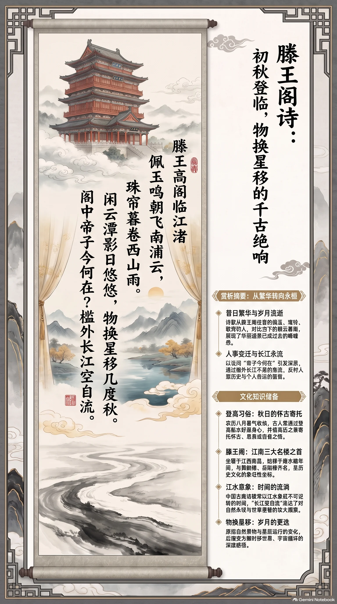

**唐·王勃** · 初秋登临怀古

## 诗词全文

滕王高阁临江渚，佩玉鸣鸾罢歌舞。
画栋朝飞南浦云，珠帘暮卷西山雨。
闲云潭影日悠悠，物换星移几度秋。
阁中帝子今何在？槛外长江空自流。

## 赏析

农历八月初，暑气渐收、云水澄明，正适合读这首临江登阁之作。诗人先从滕王阁昔日的华贵写起：佩玉、鸾铃、歌舞，都已成为过去；继而以“朝云”“暮雨”描摹高阁四周瞬息万变的景色。三、四句由眼前景转入时间感慨，“闲云潭影日悠悠”看似安静舒缓，却带出岁月流逝；“物换星移几度秋”则将个人所见扩展为宇宙间的循环更替。结尾不直接悲叹，而用设问和长江的“空自流”收束：昔日建阁的帝王不知何在，江水却依旧奔流。全诗格调开阔，提醒人们在季节转换与山川永恒之间，体察历史的流动，也珍惜当下的登临与观看。

## 相关风俗

- 古人入秋常有登高、临水、望远之习，既为舒展身心，也借高远景象寄托怀古、思亲或自省之情。
- 滕王阁位于今江西南昌，初建于唐代永徽年间，与黄鹤楼、岳阳楼并称“江南三大名楼”。
- 中国古典诗歌常以江水象征时间与历史，如“长江空自流”以不息流水反衬人事的短暂变迁。
- “物换星移”原指自然景物与星辰运行的变化，后常用来概括岁月流转、世事更替的宏大感受。

## 背后的故事

> 这首八句诗最耐人寻味处，在于它把一座新建不久的唐代王府高阁，写成了时间的废墟。“帝子”滕王李元婴原以奢侈闻名，王勃却不铺写其荣华，只用“物换星移”一笔收尽。与《滕王阁序》相伴的阎都督宴会故事，又使这首沉静的登临诗带上少年天才一挥而就的传奇色彩。

### 作者轶事

- 王勃的“早慧”并非全是后世神话。《旧唐书》称他六岁即善文辞，九岁读《汉书》而作《指瑕》十卷，未及冠便授朝散郎，入沛王李贤府中任修撰。少年骤得声名，也使他的文字带着一种锐利的自负；《滕王阁诗》表面苍茫，实际仍有少年人俯瞰江山、直追古人的气魄。 〔史实 · 《旧唐书·卷一百九十上·文苑上·王勃》〕
- 王勃仕途的折断，缘于一篇游戏文字。他在沛王府时作《檄英王鸡文》，以斗鸡拟作两王相争，唐高宗认为此文会挑动诸王嫌隙，遂将他逐出王府。后来他渡海探望任交趾令的父亲王福，遇溺受惊而死，年未三十。此种早荣、受斥与夭折的经历，令“阁中帝子今何在”的追问格外像他自己的身世回声。 〔史实 · 《旧唐书·卷一百九十上·文苑上·王勃》〕

### 本事与创作背景

- 诗与《滕王阁序》在传世文集中相连：序文自称“童子何知，躬逢胜饯”，写洪州都督阎公宴集、宾客登阁的情景；又明言“时维九月，序属三秋”。诗中“南浦云”“西山雨”与序中“俨骖騑于上路，访风景于崇阿”可互相映照，故通常视为同一次秋日阁宴后的登临之作，而非纯粹题壁怀古。 〔史实 · 《王子安集·滕王阁序》〕
- 上元二年说虽流传最广，却宜保留分寸。序文能确定的只是九月、洪州、高宴与阎公在场；王勃当时是否正由北向南赴交趾省父，阎公究竟为何人，以及现存八句是否就在宴席上即席写定，均缺少同时代的独立记录。写作时不妨将“675年秋”作为传统叙事框架，而不要当成铁案。 〔存疑〕

### 时代背景

- “帝子”所指滕王李元婴，是唐高祖之子、唐太宗异母弟。唐初宗室诸王常以都督、刺史等身份出镇要地；元婴曾任洪州都督，并在此筑阁。王勃把他称作“帝子”，不是说他是当朝皇帝之子，而是以帝室后裔的尊称点出阁名的来历。高阁的皇家气象与“今何在”的空茫，恰构成全诗的张力。 〔史实 · 《新唐书·卷七十九·高祖诸子·滕王元婴》〕
- 初唐的洪州既是赣江水路枢纽，也是地方长官展示文治与声望的舞台。都督开宴，宾客作序赋诗，并非闲适的小型雅集，而是地方官、幕僚、名士之间的公开交游。王勃在序中极写“胜友如云”“高朋满座”，诗却突然从宴乐退入江流，反映的正是盛唐以前士人常有的双重目光：一面仰望功名华宴，一面敏感于人事消歇。 〔史实 · 《王子安集·滕王阁序》〕

### 风土人情

- 唐人登高宴集，往往兼具游赏、交际与文章竞写的功能，并不只是饮酒看景。《滕王阁序》所记九月“胜饯”，先铺陈车马、宾从和宴饮，再转入凭栏远眺；诗中的“佩玉鸣鸾罢歌舞”，也应理解为对王府旧日仪仗、音乐与宾宴的浓缩想象。阁上歌舞一停，珠帘卷起，才让江雨、暮云成为真正的主角。 〔史实 · 《王子安集·滕王阁序》〕
- “南浦”“西山”并非虚泛的山水套语。滕王阁临赣江，登阁所见本就以江上洲渚、城西山岭为胜；秋日江南水气丰沛，朝云暮雨容易遮没远山。王勃把可见的地理景物安排为“朝飞”与“暮卷”，使一天的光线、湿度和江面风势，都压缩在两句对仗之中，带有很强的南方水城感。 〔史实 · 《王子安集·滕王阁诗》〕

### 民间传说与后世演绎

- 最著名的后世故事说，阎都督原想让女婿孟学士预先写好《滕王阁序》，故意遍请宾客辞让文题；王勃却接过纸笔即写。阎公初闻“南昌故郡”颇不以为然，听到“落霞与孤鹜齐飞，秋水共长天一色”才惊起称赏。这个故事极富戏剧性，但其中“王勃十四岁”等细节与其生年、行历难尽相合，宜视作唐末笔记塑造的天才传说。 〔传说 · 《唐摭言·卷五》〕
- 滕王阁后来屡毁屡建，地方记忆遂把王勃与楼阁紧紧焊在一起。明清以来重修阁宇常题“落霞孤鹜”之类匾额，并把现存建筑、栏槛乃至江景直接说成王勃当年所见。实际上唐阁早已不存，今人所见多为历代重建后的形制；“王勃凭此槛作诗”的具体定位，属于名胜叙事为增强临场感而形成的附会。 〔附会 · 《南昌府志·古迹》〕

### 典故与名物

- “佩玉鸣鸾”写的不是单纯珠玉声响，而是贵族车服礼制的声音。《礼记·玉藻》说君子行则佩玉有声，乘车则听“鸾和”之响；《诗经》中的“鸾声将将”也常用来表现车驾雍容。王勃以佩玉、鸾铃暗示滕王旧日出行与宴游的排场，接着用“罢歌舞”收束，华贵愈具体，消散愈刺目。 〔史实 · 《礼记·玉藻》；《诗经·小雅·庭燎》〕
- “南浦”在文学传统中早已不只是南边的水滨。江淹《别赋》有“送君南浦，伤如之何”，此后南浦常带送别、行旅和水际伤怀的色彩。王勃诗中“画栋朝飞南浦云”，字面先是阁前江浦的晨云，潜在地却使登阁者带上过客意识：眼前并非可以永驻的王府，而是不断送走行人的江边。 〔史实 · 《江文通集·别赋》〕
- “物换星移”以自然与天象的轮转写人世变迁。“物换”是草木、城郭、器用皆非旧观，“星移”则把时间拉到更大的宇宙尺度；它与末句“长江空自流”共同构成古典怀古诗的基本结构：人和权势都有尽时，山川流水却不为之停驻。这里未必有单一可坐实的典故，更像王勃将六朝以来的江山怀古语汇凝成一句。 〔存疑〕
