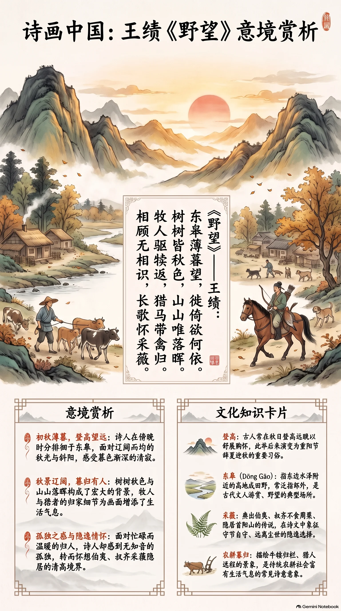

**唐代·王绩** · 初秋薄暮，登高望远

## 诗词全文

东皋薄暮望，徙倚欲何依。
树树皆秋色，山山唯落晖。
牧人驱犊返，猎马带禽归。
相顾无相识，长歌怀采薇。

## 赏析

农历八月初，暑意渐收，草木开始染上秋色，正适合读王绩这首沉静而苍茫的《野望》。诗人傍晚站在东皋远望，来回徘徊，心中却没有可以投托的对象。“树树皆秋色，山山唯落晖”以叠字铺展视野：每一棵树、每一座山都沐在秋光与斜阳里，景色辽阔而均匀，也透露出暮色渐深的清寂。后两句转入人事，牧人赶着牛犊归家，猎者携着猎物归来，乡野生活本有温暖的节奏；但诗人面对这些归人，反而感到“相顾无相识”的孤独。结尾“采薇”用伯夷、叔齐隐居首阳山采薇而食的典故，含蓄表达对高洁隐逸生活的向往。全诗语言朴素，近景与远景、热闹与孤寂彼此映照，是初唐五言律诗中情景交融的名篇。

## 相关风俗

- 古人常在秋日登高远眺，既为欣赏高天阔野，也寄托辞夏迎秋、舒展胸怀的愿望，后来逐渐成为重阳节的重要习俗。
- “东皋”指东边水泽附近的高地或田野，也常泛指郊外。古代文人喜在城郊园林、山岗水滨散步览景，称为游赏或野望。
- “采薇”典出伯夷、叔齐不食周粟、隐居首阳山的传说。后世诗文常以采薇象征守节自守、远离尘世的隐逸选择。
- 诗中“牧人驱犊返”呈现传统农耕社会的暮归场景。牛犊归栏、炊烟将起，是古典诗歌里常见而富有生活气息的乡村意象。

## 背后的故事

> 《野望》最耐人寻味处，不只是秋山落日，而是“东皋”很可能就是王绩自号“东皋子”的田园。这个曾在隋唐之间数度出仕、终于以酿酒种黍自给的文人，面对牧犊猎归的寻常人间，忽然觉得无人可识，只好把心事投向伯夷、叔齐“采薇”的古老背影。

### 作者轶事

- 王绩字无功，绛州龙门人，隋大业中举孝廉，任秘书正字而不乐，弃官归田；唐初又曾以旧官待诏门下省。史传所见的他，并非从未入世的山人，而是屡经仕隐取舍、终于把生活安顿在河渚田园的人。“徙倚欲何依”的迟疑，正有这种履历留下的底色。 〔史实 · 《新唐书·卷一百九十六·隐逸传·王绩》〕
- 王绩嗜酒而能饮，自撰《五斗先生传》，又有《酒经》《酒谱》。传中写他在田庄使奴婢种黍，春秋酿酒，养凫雁以自给；这不是后人替隐士涂上的风雅，而是一套颇具体的庄园日常。读“牧人驱犊返”时，不妨想见诗人所望并非抽象山水，而是熟悉的生计场景。 〔史实 · 《新唐书·卷一百九十六·隐逸传·王绩》〕

### 本事与创作背景

- 诗题与首句中的“东皋”，通常会联系王绩在河渚间置田、号“东皋子”一事理解：薄暮登临，所见是牧归猎返的近村图景，而非专为游览名山所作。不过现存诗中没有说明东皋的确切地点，也没有题赠对象，不能坐实为某一次具体聚会或仕途失意后的即时记录。 〔存疑 · 《新唐书·卷一百九十六·隐逸传·王绩》；《全唐诗·卷三十七》〕
- 《野望》在现存总集里仅存题目与正文，没有自序、唱和者姓名及写作年月。它的结构却很清楚：前四句由暮色中的树山铺开，五六句摄入人和牲畜归家的动态，末二句陡然从热闹的村景转为“无相识”的孤绝，并以采薇自况收束。这种由景入怀的转折，是判断其写作情境的重要内部线索。 〔史实 · 《全唐诗·卷三十七》〕

### 时代背景

- 王绩横跨隋末唐初，亲历旧朝崩解与新朝建制。对读书人而言，隐居并不必然等于绝意仕进：他本人先后受隋、唐征辟，最终仍归田。因而诗中“欲何依”不宜简单读成纯粹的山林闲适；它更像一个熟悉仕途而又不愿完全认同其秩序的人，在暮色中感到的无所归属。 〔史实 · 《新唐书·卷一百九十六·隐逸传·王绩》〕
- 初唐文坛尚未完全转入后来盛唐那种昂扬的开阔声调，隋唐易代后的文人仍常借隐逸姿态安放政治和人格焦虑。王绩被列入《隐逸传》，后世也以“高士”视之；但他的诗并不摆出远离人世的姿态，反而让牧者、猎者在画面中心经过。真正的隔阂，是“相顾”而“不相识”。 〔史实 · 《新唐书·卷一百九十六·隐逸传·王绩》〕

### 风土人情

- “牧人驱犊返”呈现的是日落归牧的乡村作息。牛犊既是畜养对象，也是耕作经济的根本；王绩田庄本有奴婢种黍、养凫雁，说明其所处的河渚生活并非只靠清谈，而兼有谷物、家禽与劳役组织。诗人写“驱犊”而不写耕田，恰能在薄暮一笔带出白日劳作已经收场。 〔史实 · 《新唐书·卷一百九十六·隐逸传·王绩》〕
- “猎马带禽归”中的猎者与“牧人”并置，使山村暮归不只有农事，也有田猎。古代礼制将季秋田猎解释为习练武事，称“教于田猎，以习五戎”；诗中当然未必写官方仪典，却能借一匹带着猎获的马，添出乡野间尚武、逐禽与归家的生活动感。初秋暮景因此不只是静景。 〔史实 · 《礼记·月令》〕

### 典故与名物

- “长歌怀采薇”最明确的典故是伯夷、叔齐。司马迁说二人不食周粟，隐居首阳山，“采薇而食之”，将饿死时还作歌咏薇。王绩不直说伯夷叔齐，而以“怀采薇”收尾，既把自己放进不肯随俗的隐者谱系，也保留了分寸：他是怀想古人，并非宣称自己已达到绝食守节的极端。 〔史实 · 《史记·卷六十一·伯夷列传》〕
- “东皋”在这首诗里不只是一个登高望远的地名标记，还容易与王绩“东皋子”的自号互相照亮。传记称他在河渚间有田，因以东皋自号；诗人将视线安放于“东皋”，等于把人格身份、居处与观看方式叠在一起。只是“东皋”具体在今何处，史传未作精确坐标，后世不宜强定单一遗址。 〔史实 · 《新唐书·卷一百九十六·隐逸传·王绩》〕
