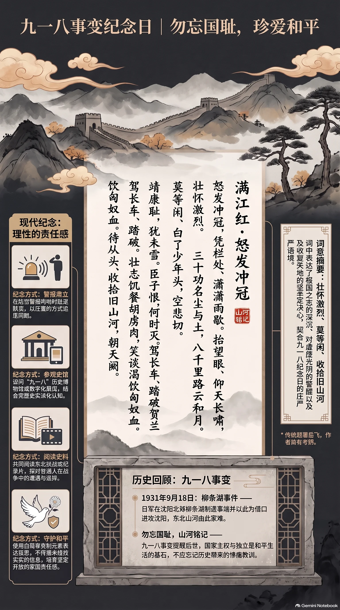

**南宋·岳飞（传）** · 九一八事变纪念日（九一八国耻纪念日）

## 诗词全文

怒发冲冠，凭栏处、潇潇雨歇。抬望眼、仰天长啸，壮怀激烈。三十功名尘与土，八千里路云和月。莫等闲、白了少年头，空悲切。
靖康耻，犹未雪。臣子恨，何时灭。驾长车、踏破贺兰山缺。壮志饥餐胡虏肉，笑谈渴饮匈奴血。待从头、收拾旧山河，朝天阙。

## 赏析

9月18日是九一八事变纪念日。1931年这一天，日军制造柳条湖事件并进攻沈阳，东北山河由此蒙难，后世常以“勿忘国耻、珍爱和平”追念历史。《满江红·怒发冲冠》传统上题为南宋抗金名将岳飞所作，虽其具体作者历来尚有考辨争议，但词中激越的爱国情怀早已深入人心，十分契合纪念日的庄严语境。

上阕从“怒发冲冠”的形象起笔，写凭栏远望、长啸问天的愤慨；“三十功名尘与土，八千里路云和月”以鲜明对比表明，个人功名微不足道，收复河山的征程才最值得珍视，并警醒青年切莫虚度光阴。下阕借“靖康耻”抒发国破家仇未雪的痛感，继而以“驾长车”“收拾旧山河”推进到慷慨誓愿。全词节奏短促有力，情感由悲愤转为担当。今天诵读它，不应停留在仇怨想象，而应从历史中理解国家独立与和平生活的来之不易，培育理性、坚定而开放的家国责任感。

## 相关风俗

- 九一八纪念日多举行防空警报试听、默哀与主题教育活动。听到警报时可驻足肃立，以庄重方式追思遇难同胞。
- 可参观“九一八”历史博物馆或线上数字展览，结合史料了解事变经过，避免只凭片段叙述形成简单化印象。
- 学校和家庭可共同阅读东北抗战史、抗战家书或纪录片，讨论和平、主权与普通人在战争中的遭遇和选择。
- 纪念活动宜使用白菊、铭记卡等克制元素，重在尊重史实、珍爱和平，不传播未经核实的历史图片和传言。

## 背后的故事

> 《满江红·怒发冲冠》最值得追问之处，恰在于它几乎塑造了现代人心中的岳飞形象，却未必能稳稳落实为岳飞手笔。词中“靖康耻”确与南宋北伐情绪严丝合缝，而“贺兰山”“匈奴”等语又带着跨时代的文学套语。九一八纪念日诵读它，是后世将宋金之痛移入近代国耻记忆的一次有力嫁接。

### 作者轶事

- 岳飞的“精忠”形象并非全由后世小说捏成。《宋史》记何铸奉命审讯时，岳飞裂开衣襟，露出背上“尽忠报国”四字，字迹已深达肌理。正史只说有刺字，并未说是岳母亲刺；后来最深入人心的“岳母刺字”母子场景，是在这一史实骨架上增饰出来的。 〔史实 · 《宋史·岳飞传》〕
- 岳飞军纪与战力在南宋军事叙事中极受强调。史传称金人相戒说“撼山易，撼岳家军难”；这句话未必是敌方原话的逐字记录，却说明岳家军已成为纪律严整、能与金军野战的象征。词中“驾长车”“收拾旧山河”的磅礴口气，正适合被后人投射到这支军队身上。 〔史实 · 《宋史·岳飞传》〕

### 本事与创作背景

- 把此词直接当作岳飞在某次北伐前的宣言，应当谨慎。今本《全宋词》将其收入岳飞名下，流传极广；但“收入总集”只能证明近世通行的归属，不能倒推出南宋已有可靠定本。尤其词中没有地点、受赠者、战役名或自注，无法与岳飞现存行军轨迹一一扣合。 〔存疑 · 《全宋词·岳飞》〕
- “三十功名尘与土”常被用来推测作者约三十岁时作词。若按岳飞生年及虚岁算法，绍兴初年似可勉强相合，遂有绍兴二年至四年间作的推断。然而这只是由词句倒推年龄；“三十”也可以是概数或慨叹青春，不能作为断代铁证，更不能据此指定为某一场战役前所作。 〔存疑〕

### 时代背景

- “靖康耻”所指，是北宋靖康二年京师陷落、徽宗与钦宗被金军掳去的巨变。赵构在南方即位后，北方故土、二帝归还与宗庙存续，长期构成朝廷政治的隐痛。因此“雪耻”“臣子恨”并不只是个人悲愤，而是南宋初年臣僚反复使用的复仇与恢复话语。 〔史实 · 《宋史·钦宗本纪》〕
- 岳飞的实际军事活动，与词中不肯罢兵的姿态确有时代张力。绍兴十年，宋军在中原数有胜捷；其后朝廷转向议和，岳飞被解除兵权，终于遇害。无论此词是否岳飞亲作，它被认作岳飞词，正因它浓缩了主战派与议和政策之间最尖锐的情绪裂缝。 〔史实 · 《宋史·高宗本纪》《宋史·岳飞传》〕

### 风土人情

- 南宋对岳飞的追崇本身经历了从政治平反到祠祀纪念的过程。孝宗时先恢复岳飞官爵、改葬，后赐谥“武穆”、追封鄂王；这使忠臣祭祀逐渐有了国家褒典的依据。后世岳王庙中的香火、题壁、秋祭，便把一位被冤杀的将领塑造成可供地方与国家共同致敬的忠烈神祇。 〔史实 · 《宋史·孝宗本纪》〕
- 将这首词置于九一八纪念日，属于现代公共记忆中的再语境化，而非宋代原有场景。1931年9月18日，日本关东军发动侵华事变；其后“勿忘国耻”的纪念仪式、学校朗诵与群众集会，特别容易借用“莫等闲”“收拾旧山河”这类句子，把宋金战争的语言转译为反侵略的民族情感。 〔史实 · 《中华民国史档案资料汇编·第五辑第一编·日本侵华》〕

### 民间传说与后世演绎

- “岳母刺字”是岳飞故事最成功的家庭化改写。《说岳全传》写岳母在儿子背上刺下“精忠报国”，把本来可能属于成年军人自我盟誓的刺字，改造成母亲训子、以孝成忠的伦理仪式。此后戏曲年画反复演绎，使“精忠”带上了强烈的母教与家国同构色彩。 〔传说 · 《说岳全传·第二十二回》〕
- 杭州“风波亭”常被指认为岳飞父子遇害处，名称本身也因小说戏曲而格外凄厉。但《宋史》只记岳飞在狱中被害，并未明确行刑地点；《说岳全传》才以“风波亭父子归神”的场面固定了这一地名。今天围绕风波亭的具体址点，多应视作后世纪念地理，而非可据正史坐实的现场。 〔传说 · 《宋史·岳飞传》《说岳全传·第六十一回》〕

### 典故与名物

- “怒发冲冠”并非单纯写头发竖起。《史记》写蔺相如在秦廷上索璧抗争，“怒发上冲冠”，是弱国使者以气节对抗强权的经典姿态。词开头借这一成语起势，立刻把雨歇凭栏的个人动作提升为不受屈辱、准备抗争的历史性表情。 〔史实 · 《史记·廉颇蔺相如列传》〕
- “胡虏”“匈奴”在这里不能按民族史字面理解：岳飞所面对的是女真建立的金朝，并非汉代匈奴。中国古典诗文常以“胡”“匈奴”泛指北方劲敌，带有汉唐边塞诗的修辞惯性。“饥餐胡虏肉，渴饮匈奴血”是极端复仇誓言，重点在夸张的吞敌意象，不宜误读为真实军中行为。 〔史实 · 《宋史·金国传》〕
- “朝天阙”的“阙”本指宫门两旁的高台，后又成为帝王宫城、朝廷的代称。“待从头收拾旧山河，朝天阙”不是单说凯旋回家，而是设想收复之后入朝献捷、向皇帝复命。结尾把山河、军功与君臣礼仪连成闭环，也正是忠君叙事最能打动后代读者之处。 〔史实 · 《尔雅·释宫》〕
