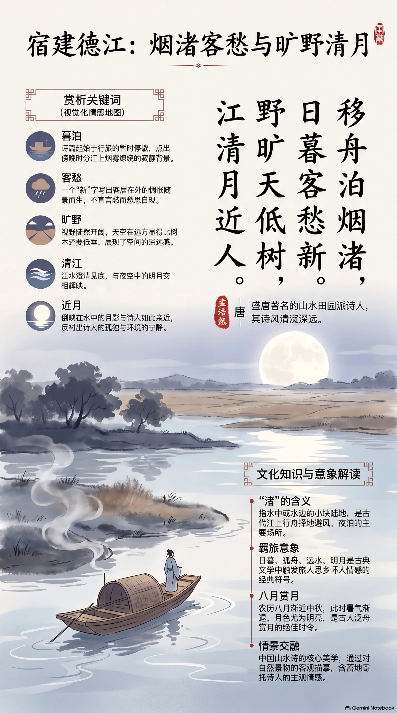

**唐·孟浩然** · 初秋江夜泊舟

## 诗词全文

移舟泊烟渚，日暮客愁新。
野旷天低树，江清月近人。

## 赏析

这首诗写诗人傍晚乘船行至建德江边，在烟雾笼罩的小洲停泊时所见所感。“移舟泊烟渚”点出行旅与停泊，暮色中的江洲朦胧寂静；“日暮客愁新”不直说具体愁绪，却以一个“新”字写出客居在外、触景而生的惆怅。后两句视野陡然开阔：原野空旷，仿佛天空低垂到树梢；江水澄清，水中月影似乎格外亲近行人。诗人把难言的孤独融入清江、旷野与明月之中，使情绪不显逼仄，反而显得清澹深远。初秋夜晚，暑气渐退、月色渐明，读此诗可感受古人舟行暮泊时的安静，也能体会中国山水诗“以景寓情”的含蓄之美。全诗仅二十字，远近、高低、动静交织，画面简净而余味悠长。

## 相关风俗

- 农历八月渐近中秋，古人常在清秋赏月、泛舟或登高。明月既是时令景物，也常寄托思乡与怀人的情感。
- “渚”指水中或水边的小块陆地，江上行舟常择渚边避风夜泊。烟渚在诗中兼具水汽迷蒙与暮色朦胧的视觉意味。
- 中国古典诗歌常以“羁旅”书写人在旅途中的心境。日暮、孤舟、远水、明月，都是触发客愁的典型意象。
- 山水诗讲究情景交融，不一定直陈悲喜。此诗借低天、旷野、清江与近月，呈现出孤寂而澄明的审美境界。

## 背后的故事

> 《宿建德江》最耐人寻味处，不在某个显赫典故，而在一位屡试不第的襄阳诗人，沿浙西水路夜泊江渚时，将“客愁”压缩成四句的视野变化：从船头烟渚，推至低树远天，再收回仿佛贴近舟人的清江月。诗题虽点建德，具体行年却无从坐实。

### 作者轶事

- 孟浩然本是襄阳士人，并非终身未入仕途而全然与功名无涉。他四十岁左右曾入长安应进士而不第，旋即还乡；这段挫折使其诗中“客”“归”“愁”等字常带有仕进未成、旅途无着的底色。读“日暮客愁新”，不妨想到这位布衣诗人并非纯粹山林闲客，而是曾在京城门径前徘徊过的人。 〔史实 · 《旧唐书·卷一百九十下·孟浩然传》〕
- 孟浩然的性情，在正史叙述中颇有不拘礼法的一面。《新唐书》载其背疽未愈，医生本戒绝食鲜；王昌龄来访，他仍为故人设宴，饮食谈笑间病势骤发而卒。此事未必能直接解释《宿建德江》的清寂，却可为写作提供一个侧影：他并非冷峭自守的隐者，也有重友情、任情率性的生活温度。 〔史实 · 《新唐书·卷二百三·文艺下·孟浩然传》〕

### 本事与创作背景

- 此诗能确定的“本事”极少：题目明言宿泊建德江，首句又写“移舟泊烟渚”，可知它首先是一首舟中暮泊的即景诗，而非有明确酬赠对象的唱和篇。诗中没有官职、人名、宴集或送别语，所谓“客愁”宜理解为旅人当暮新起的情绪，不能坐实为一次政治失意或特定离别。 〔史实 · 《全唐诗·卷一百五十九》〕
- 建德在唐属睦州，位于钱塘江上游水系的交通地带。诗人从舟行、移泊到夜望，提示这不是山居庭院中的静观，而是水路旅行中的短暂停靠。江上的雾气、沙洲和开阔天宇，都属于行舟者抵岸后才获得的视角；末句“月近人”也像是船泊江清、四围灯火稀少时的切身感受。 〔史实 · 《元和郡县图志·卷二十五·睦州》〕

### 时代背景

- 开元时期的科举与京师交游，为文士提供上升机会，也制造了大量落第、外游与返乡者。孟浩然应试不第后归襄阳，是这类士人经历的一个有据样本。因此诗里的“客”不只是地理身份：对唐代读者而言，它也容易牵出游京、干谒、漫游和功名未遂等共同经验。不过本诗并未明说仕途，不宜把它径直释作怨刺。 〔史实 · 《旧唐书·卷一百九十下·孟浩然传》〕
- 唐代睦州隶江南东道，山水与江道并非远离制度的“纯自然”空间，而是州县、邮传、商旅和民间舟行共同构成的区域网络。孟浩然诗常被后人归入山水田园一脉，但“移舟”“泊”两个动词保存了旅运中的实际动作：先在水面调整船位，再拣洲渚临时停靠，清景是由行役生活生发出来的。 〔史实 · 《新唐书·卷四十·地理志四》〕

### 风土人情

- “渚”不是泛指漂亮的水边，而是江河中可见的小洲、沙洲。《尔雅》以“小洲曰渚”释之。将船泊在“烟渚”，画面便不宜想成有客舍、埠头的城市码头，而更接近暮霭笼罩的江心或近岸沙洲。这样的停泊处四顾无遮，恰能说明为什么下一句忽然出现“野旷天低树”的大幅远景。 〔史实 · 《尔雅·释水》〕
- “初秋江夜”的说法适合营造凉意，却不是诗中能够坐实的季节信息。全诗没有“秋”“露”“雁”“寒”等物候字，月色、烟渚和日暮在春夏秋冬皆可能出现。写作时可把初秋作为当代读者易于进入的场景设定，但最好保留弹性：孟浩然写的是暮泊后天清江阔的感受，而非一首可据字面断定的秋令诗。 〔存疑〕

### 典故与名物

- “野旷天低树，江清月近人”并非逐字套用某一前代典故，妙处正在空间错觉。旷野中树木低伏于天际，令天空似乎下压；清江中的月影与舟人相对，又令月亮似乎近身。两句以“低”“近”写视觉关系，而不说“高”“远”，把通常宏大的天地转化为夜泊孤客所感到的逼近与包围。 〔史实 · 《全唐诗·卷一百五十九》〕
- “客愁新”的“新”尤其值得咀嚼：它不是说愁绪轻浅、清新，而是说旧有的漂泊心事在日暮停舟的一刻又被重新触发。首句“移舟”仍有行动，次句一到“日暮”便顿住；后两句把人置于低天、阔野、清江与近月之间。诗的结构因而像镜头由动作转静观，最后以“人”字收束，孤身感格外分明。 〔史实 · 《全唐诗·卷一百五十九》〕
