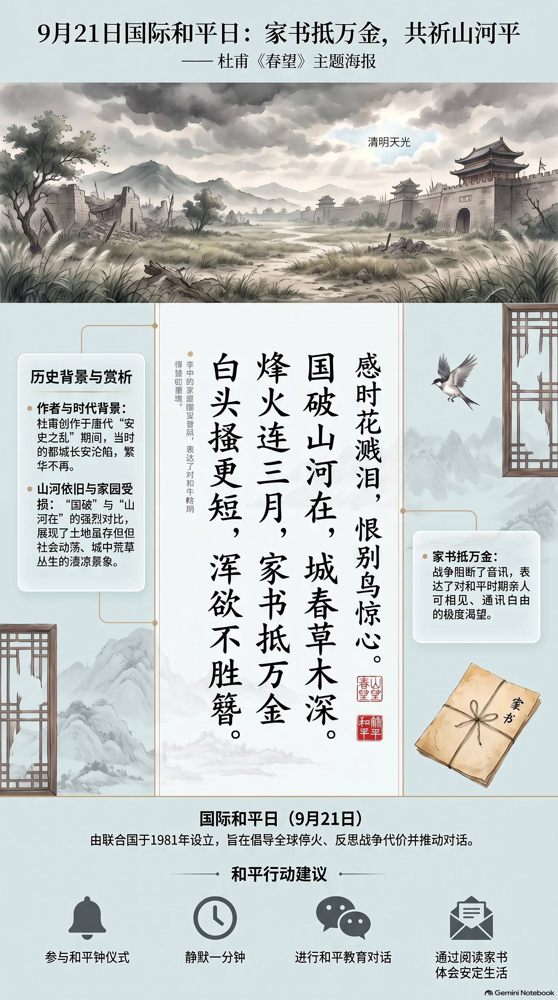

**唐代·杜甫** · 国际和平日

## 诗词全文

国破山河在，城春草木深。
感时花溅泪，恨别鸟惊心。
烽火连三月，家书抵万金。
白头搔更短，浑欲不胜簪。

## 赏析

9月21日是联合国确定的国际和平日，旨在呼吁停火、反思战争代价并珍视和平。杜甫《春望》虽写于唐朝安史之乱期间，却与这一纪念日形成深切呼应。诗人目睹长安沦陷，山河依旧，城中却荒草丛生；“国破”与“山河在”、“城春”与“草木深”的强烈对照，写尽繁华都城遭受战乱后的凄凉。颔联以移情手法写花鸟：花似为时局而落泪，鸟鸣反使离人惊心，景物也染上了忧国伤时的感情。“烽火连三月，家书抵万金”尤为传诵，战争阻断亲人音讯，一封平安家书便珍贵如金。末联写诗人愁苦至极，频频搔头，白发稀疏得几乎插不住簪子。全诗从国家残破写到家庭离散，再落到个人身心，揭示战争对土地、城市和普通人的共同伤害。今日重读，不仅能感受杜甫的悲悯，也更能理解和平并非抽象口号，而是家书可达、亲人相聚、日常生活安稳的珍贵现实。

## 相关风俗

- 国际和平日由联合国于1981年设立，日期为每年9月21日，倡导各地以停火、对话和教育行动关注和平。
- 学校或社区可举行和平主题朗诵会，诵读《春望》等作品，并结合历史背景讨论战争对普通家庭的影响。
- 可在当天参与和平钟、静默一分钟或点亮和平烛光等活动，以安静而庄重的方式表达反战与祈愿。
- 家庭可借“家书抵万金”的诗句开展家书阅读或亲情通信，让青少年体会安定生活与亲人音讯的可贵。

## 背后的故事

> 《春望》最刺痛人的地方，不是抽象地哀叹“国破”，而是杜甫作为被困敌占长安的诗人，看见春花春鸟反而不能欢喜：美景与废都、家书断绝并置，遂使个人衰老成为战争的刻痕。用于国际和平日，它能让“和平”从口号落到一封无法送达的家书、一头无处簪起的白发上。

### 作者轶事

- 杜甫并非安史乱起后一直安坐成都的“诗圣”。长安陷落后，他先安置妻儿于鄜州羌村，旋即欲奔赴肃宗行在，途中被叛军俘获，困居长安。因官微而未受严密拘束，才得以在残破京城中行走、观察；《春望》的视角正是一个有家难归、欲报国无门的陷城者。 〔史实 · 《旧唐书·卷一百九十上·杜甫传》〕
- 杜甫脱身至凤翔后，肃宗授他左拾遗，这是能在朝廷规谏、补阙的近侍小官。他不久即因营救遭贬的宰相房琯而触怒肃宗，终被放还华州。此事说明《春望》中“感时”并非纯粹旁观者的悲伤：他对于朝局的焦灼，后来确实落实为近乎不计利害的进谏。 〔史实 · 《旧唐书·卷一百九十上·杜甫传》〕

### 本事与创作背景

- 此诗通常系于至德二载春。当时叛军虽已在洛阳失势，却仍占据长安；唐肃宗驻凤翔，收复两京的大军尚未入城。杜甫身在沦陷首都，开篇所称“国破”并非唐朝国号已亡，而是皇都失守、官署与坊市秩序崩解所造成的切身景象。 〔史实 · 《杜诗详注·卷四》〕
- 《春望》没有题赠对象，也没有序文交代写给谁；“家书”却泄露了最具体的牵挂。杜甫的妻子杨氏与儿女当时留在鄜州一带，关山之间横着战区和军中关隘。一封家信之“抵万金”，不是市价计算，而是乱世里确认亲人存亡的消息极难获得。 〔史实 · 《旧唐书·卷一百九十上·杜甫传》〕

### 时代背景

- 天宝十四载安禄山起兵，次年长安失守，玄宗奔蜀，太子李亨在灵武即位，是为肃宗。旧有的中央朝廷骤然分裂为流亡朝廷、叛军政权与各地军镇，百姓则承受征发、逃亡与道路阻绝。“城春草木深”因此不是普通的暮春荒园，而是帝国行政中心失去日常治理后的反常繁茂。 〔史实 · 《资治通鉴·卷二百一十八》〕
- “烽火连三月”宜理解为战火、警讯绵延不绝的诗性概括，未必是可逐日核算的三个月战期。唐代边防与州郡本有烽燧传警制度，火光、烟讯意味着军情紧急；在安史乱局中，它又被扩大为全民熟悉的战争声响。诗人以官方军情符号写私人恐惧，接到“家书抵万金”尤显沉重。 〔史实 · 《通典·卷一百四十九·兵二·烽候》〕

### 风土人情

- 末句的“簪”不是女子首饰的专称。唐代成年男子束发戴冠、幞头，常须以簪固定冠饰或发髻；头发稀短，便难以胜任簪插。杜甫说“白头搔更短”，先写忧愁中反复搔首，再以“浑欲不胜簪”写出近乎狼狈的仪容失序：国破家散，连士人维持整冠束发的体面也难了。 〔史实 · 《仪礼·士冠礼》〕

### 典故与名物

- “感时花溅泪，恨别鸟惊心”并非实指花会流泪、鸟能惊心，而是古典诗歌常见的移情与互文句法：可理解为诗人因伤时见花落泪、因恨别闻鸟惊心，也可读作花鸟仿佛沾染人的哀感。二者不必强分。其高明处在于把本应最能慰人的春景变成触发创伤的媒介，和首联的荒城春色相互扣合。 〔史实 · 《杜诗详注·卷四》〕
