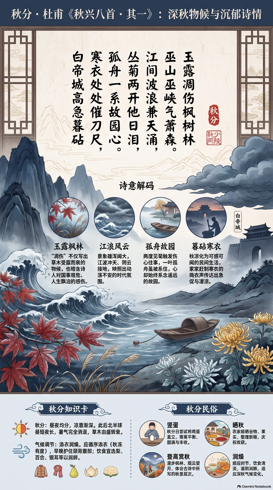

**唐·杜甫** · 秋分

## 诗词全文

玉露凋伤枫树林，巫山巫峡气萧森。
江间波浪兼天涌，塞上风云接地阴。
丛菊两开他日泪，孤舟一系故园心。
寒衣处处催刀尺，白帝城高急暮砧。

## 赏析

秋分前后，昼夜渐趋均分，暑气消退，露重风凉，草木由盛转衰。杜甫此诗作于寓居夔州的秋日，正以“玉露”“枫林”开篇，写出清冷而浓重的深秋气息。“凋伤”不仅是草木受露而衰，也暗含诗人对国事艰危、人生飘泊的感伤。颔联由近处江浪写到边塞风云：江波仿佛冲天涌起，阴云似与大地相接，景象雄浑阔大，映照出动荡不安的时代。

后四句由写景转入抒情。两度见菊，使旧日流泪的伤心事再被触发；一叶孤舟被缆绳系住，诗人的心却始终系念着遥远的故园。结尾写家家赶制寒衣、城头暮色中传来急促捣衣声，秋凉已化为可感可闻的民间生活。全诗将秋分时节的物候、羁旅之愁与忧国思乡之情交织在一起，沉郁顿挫而境界苍茫。

## 相关风俗

- 秋分宜留意昼夜温差，民间常有“春捂秋冻”之说，但应循序添衣，尤其早晚及时护住颈背与腹部。
- 部分地区有“竖蛋”习俗，在秋分日尝试把新鲜鸡蛋直立桌面，借此寄寓平衡、圆满与丰收的愿望。
- 秋季正逢收获时令，传统农家会晒谷、晒果、整理新粮；今日也可采购时令谷物，减少食物浪费。
- 秋分后燥意渐显，饮食可适当选梨、百合、芝麻、银耳等润燥食材，同时避免过食辛辣煎炸。
- 适合登高赏秋、观云望月或漫步枫林，在渐凉天色中体会古诗所写的秋景层次与时序变化。

## 背后的故事

> 这首诗最有张力的地方，在于杜甫把夔州一城的秋声写成了整个帝国的余震：江涛如天崩，边塞阴云压地，而一叶被缆绳拴住的孤舟，又把诗人的归洛之心具体化为触手可及的物象。“寒衣”“刀尺”“暮砧”尤其不是单纯的凄清布景，而是家家准备御寒衣物的日常劳作。

### 作者轶事

- 杜甫到夔州时已五十余岁，长期漂泊、贫病交加，却迎来晚年创作最密集的一段时日。他居高临峡江，写山城、瀼西、白帝、瞿塘的诗极多。《秋兴八首》正是这段“困守而高产”的结晶：身体被峡江留住，诗的视野却仍越过关塞，直抵长安、洛阳。 〔史实 · 《旧唐书·杜甫传》〕
- 杜甫并非只以“诗圣”的庄严面目示人。他晚年诗中常见窘迫的家计、药物、租税、舟行和邻里声息；在夔州还亲自经营瀼西草堂，辟地种菜。因而“孤舟一系”不只是浪漫化的流寓姿态，也带着一家老小等待行期、却无力立刻东归的实际困顿。 〔史实 · 《杜工部集·秋日夔府咏怀奉寄郑监李宾客一百韵》〕

### 本事与创作背景

- 《秋兴八首》是一组首尾相贯的七律，不是临时题壁的单篇。其一先以夔州秋景开局，后数首渐次追忆长安曲江、昆明池、宫阙苑囿，形成“身在夔州，心返京华”的空间往复。第一首中的巫山、巫峡、白帝城，正是整组诗铺开的现实坐标。 〔史实 · 《杜工部集·秋兴八首》〕
- “丛菊两开他日泪”通常解释为杜甫在夔州已历两秋：菊花第二度开放，勾起前一年与今年积存的泪水；“他日”也可含对往日、异日的复沓追想。此说与组诗写于大历元年秋的系年相合，但“两开”究竟专指两年还是兼写重重愁绪，注家仍有分歧。 〔存疑 · 《杜诗详注·卷十七》〕

### 时代背景

- 安史之乱虽在宝应元年平定，唐廷却未恢复开元时的整合力量。河北藩镇坐大，西北又长期受吐蕃威胁，朝廷财政与军政皆显衰态。“塞上风云接地阴”因而不宜只看作天气：边塞军情像阴云一样压入峡中，是战后国家仍不安宁的心理背景。 〔史实 · 《旧唐书·代宗本纪》〕
- 夔州在长江三峡东口，既是巴东山城，也是沟通蜀地与荆楚的水路节点。杜甫在此既远离两京，又随时能从行旅、驿传和江上舟楫听到天下消息。诗中“江间”与“塞上”被两个对句猛然连接，正反映峡居者并非闭塞，而是被帝国交通与战乱消息包围。 〔史实 · 《水经注·江水》〕

### 风土人情

- “寒衣处处催刀尺”写的是入秋裁制冬衣。刀用于裁布，尺用于量度；古人以秋令授衣，家中妇女赶在寒气加深前缝制夹衣、絮衣。诗句中的“催”极有生活感：它不是宫廷仪式，而是峡城家家户户都被季候催赶着开始的针线营生。 〔史实 · 《诗经·豳风·七月》〕
- “暮砧”是黄昏捣衣之声。布帛经捶打可更柔软洁净，捣衣杵、砧石的声响在秋夜尤其清晰；文学中它又常牵动征人未归、闺中制衣的离愁。杜甫写“白帝城高急暮砧”，将高城的地势、暮色中的劳动声与游子的乡思压在同一结句里。 〔史实 · 《乐府诗集·相和歌辞·捣衣篇》〕
- 题设若取“秋分”作阅读场景，应注意诗中只明言“秋兴”及菊、寒衣等秋令物候，并无可据以锁定秋分当日的纪日。秋分作为二十四节气，古代天文历法以昼夜均分为其要义；将本诗放在秋分附近阅读很贴切，却不可当作作品的确切写作日期。 〔史实 · 《淮南子·天文训》〕

### 典故与名物

- “巫山巫峡”首先是实地名物，并非必须指向巫山神女的艳情典故。巫峡江道狭峻，水流湍急，两岸高山夹江；杜甫用“气萧森”写其秋日森寒，正合峡中地形。后世读者容易因宋玉《高唐赋》《神女赋》联想神女，但本诗的情调实为家国愁思，与香艳传统有意拉开距离。 〔史实 · 《水经注·江水》〕
- 白帝城在夔州城东的白帝山上。东汉公孙述据蜀时，曾因当地出现白色瑞气而自号“白帝”，城名由此附会而来。杜甫笔下“白帝城高”不是泛泛的古城意象：它正临瞿塘门户，高城、急砧、暮江相互映衬，使听觉上的急促也带上峡口险峻的地理质感。 〔史实 · 《后汉书·公孙述传》〕
- “故园”所系并不只是成都草堂。杜甫祖籍京兆杜陵，又长期关心洛阳、长安及中原故土；安史乱后他屡怀北归、东归之愿。《闻官军收河南河北》中“即从巴峡穿巫峡，便下襄阳向洛阳”，可与此诗的“孤舟一系故园心”互读：船缆系舟，乡心却早已向东而去。 〔史实 · 《杜工部集·闻官军收河南河北》〕
