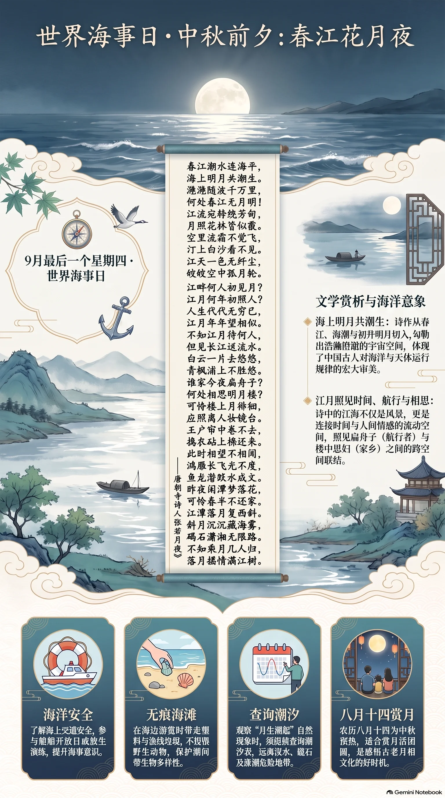

**唐代·张若虚** · 世界海事日（9月最后一个星期四；兼农历八月十四、中秋前夕）

## 诗词全文

春江潮水连海平，海上明月共潮生。
滟滟随波千万里，何处春江无月明！
江流宛转绕芳甸，月照花林皆似霰。
空里流霜不觉飞，汀上白沙看不见。
江天一色无纤尘，皎皎空中孤月轮。
江畔何人初见月？江月何年初照人？
人生代代无穷已，江月年年望相似。
不知江月待何人，但见长江送流水。
白云一片去悠悠，青枫浦上不胜愁。
谁家今夜扁舟子？何处相思明月楼？
可怜楼上月徘徊，应照离人妆镜台。
玉户帘中卷不去，捣衣砧上拂还来。
此时相望不相闻，愿逐月华流照君。
鸿雁长飞光不度，鱼龙潜跃水成文。
昨夜闲潭梦落花，可怜春半不还家。
江水流春去欲尽，江潭落月复西斜。
斜月沉沉藏海雾，碣石潇湘无限路。
不知乘月几人归，落月摇情满江树。

## 赏析

2026年9月24日是9月最后一个星期四，适逢世界海事日；又值农历八月十四，明月将圆，正与《春江花月夜》的“海上明月共潮生”相映。张若虚从春江、海潮和初升明月写起，把浩瀚澄澈的天地铺展开来。继而由“江畔何人初见月”的追问，想到人世代谢无穷、江月却年年相似，形成开阔而略带惘然的宇宙意识。后半篇转入扁舟游子与明月楼中思妇的两地相思：月光穿帘入户，既照见离愁，也成为彼此遥寄情意的媒介。结尾月沉、江树摇情，余韵悠长。诗中江海并非单纯风景，而是连接时间、航行、乡思与人间情感的流动空间；在关注海洋的今日重读，尤能体会人和水域、月相与潮汐之间的古老联系。

## 相关风俗

- 沿海学校、港口可在世界海事日举办船舶开放日、航海知识展和救生演练，了解海上交通安全。
- 到海边游览宜践行“无痕海滩”：带走塑料、渔线等垃圾，不投喂野生动物，也不采挖潮间带生物。
- 农历八月十四常作中秋前夕预热，可与家人试制月饼、赏月话团圆；临水夜行须远离深水和涨潮地带。
- 可查询当地月相与潮汐表，观察“月生潮起”的自然现象；切勿在礁石、堤坝或陌生滩涂上冒险观潮。

## 背后的故事

> 《春江花月夜》最耐人寻味处，在于它原是“吴声歌曲”旧题，却被张若虚写成一幅从潮生海月到落月江树的宇宙长卷。诗中并非只有春景：捣衣砧、鸿雁鱼龙、碣石潇湘，把闺中相思、行旅阻隔与南北山河一并纳入月光。置于中秋前夕或世界海事日诵读，更可看见它以江潮连接海洋、以月色穿透古今的开放结构。

### 作者轶事

- 张若虚是扬州人，仕途所见仅“兖州兵曹”一职；史家又将他与贺知章、张旭、包融并称“吴中四士”。这一小圈子颇有意味：贺知章以清谈豪放著名，张旭以狂草闻名，而张若虚传世诗仅二首，却凭一篇《春江花月夜》留下极强的辨识度。其人事迹稀少，反使这首诗像从江南月色中突然显影的孤篇。 〔史实 · 《新唐书·卷二〇二·文艺传中》〕

### 本事与创作背景

- “春江花月夜”不是张若虚自创的题目，而是乐府“清商曲辞”中的吴声歌曲旧题。旧题本就容纳春江、花林、明月与游子等江南乐府意象；张若虚没有依常格铺陈艳情，而将一支本可短小歌唱的曲子扩展成由潮、月、江、梦串联的长篇哲思。这是理解其“孤篇横绝”感的关键：新意首先发生在旧题之内。 〔史实 · 《乐府诗集·卷四十七·清商曲辞》〕
- 此诗没有可核实的“为某人而作”本事。诗内虽分出“扁舟子”与“明月楼”中的离人，像一场隔江互望的男女相思，但两者是乐府抒情中常见的角色设置，不能据此坐实为张若虚个人恋爱经历。“昨夜闲潭梦落花”也只是诗中主人公的梦境，不宜直接当作作者行旅日记。 〔存疑〕

### 时代背景

- 初唐诗歌正在把六朝以来的宫体、乐府声情，转化为更开阔的空间和时间意识。张若虚笔下“江畔何人初见月”不求玄学论证，而以人人可见的江月追问人生代谢；随后又落回楼上思妇、江中舟子。宏大的宇宙感与具体的离愁并置，正是唐诗逐渐摆脱单纯绮靡、又不废声情的一种写法。 〔史实 · 《乐府诗集·卷四十七·清商曲辞》〕
- “月照高楼—思妇望月”的画面并非凭空而来。曹植《七哀诗》已有“明月照高楼，流光正徘徊；上有愁思妇”之句，张若虚的“可怜楼上月徘徊，应照离人妆镜台”显然承接了这一抒情语汇。但他把高楼月光延展到玉帘、砧石、江水，使室内的愁绪与江海潮汐互相映照。 〔史实 · 《文选·曹植〈七哀诗〉》〕

### 风土人情

- “捣衣砧”不是纯粹的悲秋布景。古人处理丝麻织物，要在砧石上以杵反复捶捣，使布帛洁净、柔软或便于染治；“碪”字本义便是捣衣石。夜深月明时，砧声传得很远，因此在乐府与唐诗里常被写成妇人操持家务、又思念戍客或远人的声音。诗中月光“拂还来”，正把无形月色写得仿佛也受砧声驱遣。 〔史实 · 《说文解字·石部》〕
- 题设虽在八月十四、中秋前夕，但诗的内部季节其实是春天：“芳甸”“花林”开篇，后段又明说“春半不还家”“江水流春去欲尽”。中秋月是后世最熟悉的团圆月，诗中的春月却偏偏照见离别和归期难卜。朗诵时可利用这种错位：同一轮月在节令礼俗中象征团圆，在乐府叙事中却不断放大阻隔。 〔史实 · 《全唐诗·卷一百一十七》〕
- “春江潮水连海平，海上明月共潮生”尤其适合世界海事日的场景，但它不是航海日志。诗人从江潮入海、再以月随潮生，构成的是可感而不可量的水域想象；“扁舟子”也只是江上漂泊者的典型形象。若作海洋主题写作，可抓住它把内河、潮汐、海面与远行者连成一体，而不必误说张若虚曾有可考的海上旅行。 〔史实 · 《全唐诗·卷一百一十七》〕

### 典故与名物

- “月照花林皆似霰”中的“霰”，是雪珠、雪粒一类的降水，并非普通飘雪。诗人说花林在月下“似霰”，继而又写“空里流霜不觉飞”，实际是在层层转换视觉：月色像雪粒，月华像流霜，白沙又与月光融成一片。它们共同造成江天无尘、物我边界消失的清冷质感。 〔史实 · 《说文解字·雨部》〕
- “鸿雁长飞光不度，鱼龙潜跃水成文”常将鸿雁、双鲤理解为传书意象：苏武故事中已有“雁足系书”的著名说法，汉乐府又有剖开“双鲤鱼”得书的想象。张若虚却写即使鸿雁飞得高远，也带不过月光；鱼龙虽能搅动水纹，也不能替人传递相思。传统通信意象在此被反转为不可通达的证据。 〔史实 · 《汉书·苏武传》；《乐府诗集·杂曲歌辞·饮马长城窟行》〕
- “碣石潇湘无限路”将两处相隔极远的地理标志并置。碣石在北方滨海，是古代叙写北地、观海时常用的坐标；潇湘则指湘水及潇水汇流一带，代表南方水乡。诗句未必是在交代实有的行程，而是用北海与南楚拉出纵贯南北的辽阔距离：斜月沉入海雾，归路遂仿佛无穷无尽。 〔史实 · 《尚书·禹贡》；《水经注·湘水》〕
