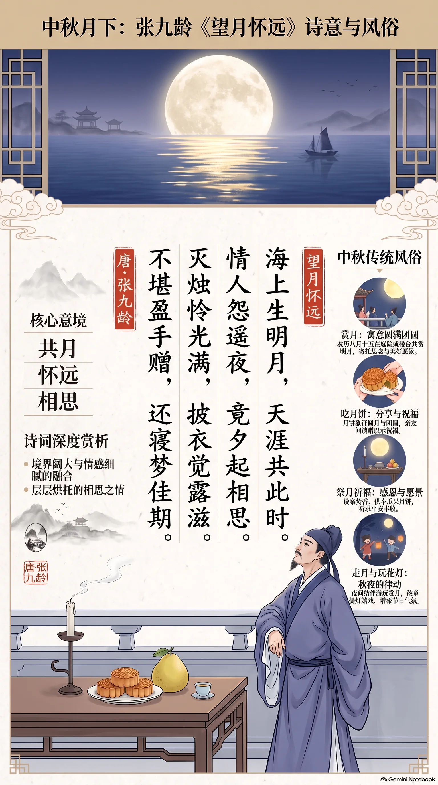

**唐·张九龄** · 中秋节

## 诗词全文

海上生明月，天涯共此时。
情人怨遥夜，竟夕起相思。
灭烛怜光满，披衣觉露滋。
不堪盈手赠，还寝梦佳期。

## 赏析

农历八月十五为中秋节，是一年秋月最圆、最适宜团聚赏月的日子。张九龄这首《望月怀远》以“海上生明月，天涯共此时”开篇，写月亮从海天交际处升起，光辉同时洒向相隔万里的亲友。诗句境界阔大，却不显空泛：同一轮明月成为跨越空间的情感纽带，因而千百年来常被用来表达中秋思亲、怀友之情。次联从“共月”转入“相思”，长夜难眠的怅惘真切自然。后四句尤见构思精巧：诗人吹灭蜡烛，是为了更好地欣赏满室月光；披衣步出，又感到秋露渐浓。月色虽美，却无法掬在手中赠给远人，最终只能在梦中期待相会。全诗语言朴素凝练，不直说悲苦，而以月光、烛火、露水和无眠的动作层层烘托，使清美的月夜与深沉的思念交融。中秋读此诗，也提醒我们珍惜眼前团圆，并向远方亲友送上一句问候。

## 相关风俗

- 赏月：中秋夜全家常在庭院、阳台或临水处观月，寓意圆满团圆；若天阴，也可围坐谈月、读诗寄兴。
- 吃月饼：月饼圆如满月，象征团圆和美。切分月饼时宜按家中人数分食，兼具分享与祝福之意。
- 祭月祈福：旧俗有设香案、陈列瓜果月饼、向月祈愿的仪式；今日可简化为敬月、许愿，重在表达感恩。
- 走月与玩花灯：不少地区中秋有饭后结伴赏月、提灯游行的习俗，尤其适合亲子家庭感受秋夜与社区节庆氛围。

## 背后的故事

> 《望月怀远》最耐人寻味处，不在一场可考的中秋宴饮，而在它刻意不交代地点、对象与日期：一轮月从海上升起，便把“天涯”两端的人同时纳入光中。张九龄身历开元末年政局的骤变，诗却不用仕途语汇，只以灭烛、披衣、露滋写出无法寄递的相思。

### 作者轶事

- 张九龄是韶州曲江人，开元末入相，以敢言和识人著称。他曾针对玄宗宠信牛仙客等事反复论谏，主张宰相须由才望之士担任；这种不肯一味顺从的性格，使他在朝中声望很高，也埋下与李林甫不合的伏线。读此诗的温厚克制，宜记得诗人并非一味风流的馆阁文士。 〔史实 · 《新唐书·卷一二六·张九龄传》〕
- 开元二十四年，张九龄罢知政事，出为荆州长史，后来又任桂州都督、岭南按察使，终卒于故乡附近。其仕途由中枢转向南方州郡，确有“远”与“天涯”的人生经验；但不能因此径直判定本诗作于贬出之后，诗中的远人也未必是政治同调。 〔史实 · 《旧唐书·卷九十九·张九龄传》〕

### 本事与创作背景

- 题目“望月怀远”已点明写法：先有可见的月，后有不可见的远人。诗中“情人”在古汉语里可泛指多情、有情之人，不必坐实为恋人；“天涯”也可以是空间想象，而非实指海外或某处贬所。现存早期总集未保留赠答对象，任何具体的爱情故事都只能算后人的补白。 〔存疑 · 《全唐诗·卷四十八·张九龄》〕
- 这首诗今天常被置于中秋场景朗诵，但作品本身没有“八月”“十五”“中秋”等节令标记。它写的是一夜由望月、灭烛、披衣到还寝的时间流程，任何明月之夜皆可成立。将其定为中秋诗，是后世节俗阅读赋予它的适配性，不是可以据文本证实的创作本事。 〔存疑 · 《全唐诗·卷四十八·张九龄》〕

### 时代背景

- 张九龄居相位时，正当开元政治由励精求治转向倦勤、用人渐受近幸影响的关口。史传特别记载他与李林甫的冲突：张九龄以李林甫“口蜜腹剑”、不可任用，玄宗终未采纳。此诗不作怨刺，却以“竟夕”“不堪”写无从排遣的情绪，适合放在盛世暮色初起的心理背景中体味。 〔史实 · 《资治通鉴·卷二一四·唐纪三十》〕
- 唐代士人仕宦与交游常横跨京师、江汉、岭南，书信、使者虽能传递消息，却无法消弭旅居与离别的时差。“天涯共此时”并非宣称两人即时通信，恰恰是以月光的同时抵达，反衬人事的不能相见。月亮在这里是一种天然、无须驿传的共同媒介。 〔史实 · 《唐六典·卷五·尚书兵部》〕

### 风土人情

- “灭烛怜光满”可作唐人夜居的一幅细节画：烛火本为照明，月光既满，反觉人造的灯焰多余；灭烛之后披衣临窗，露气渐湿衣襟。它不是固定仪式，而是借居室生活的动作转换心境：越不借灯火，越显月色清凉，也越显独处无人。 〔史实 · 《全唐诗·卷四十八·张九龄》〕
- 北宋汴京的中秋已形成明确的玩月市俗：节前店铺卖酒，贵家结饰台榭，民间争登酒楼，子弟通宵游玩。以此反观张九龄诗中安静的卧室与露夜，可见同是月节，后世城市狂欢与唐诗的私语式怀人相去甚远。宋人的记载也说明此诗何以格外适合后来中秋选本。 〔史实 · 《东京梦华录·卷八·中秋》〕

### 典故与名物

- “天涯共此时”的构想与谢庄《月赋》的名句“美人迈兮音尘阙，隔千里兮共明月”一脉相承：现实中音信阻绝，月亮却可为相隔千里者共有。张九龄把赋体中铺陈的“共明月”压缩成五字，开篇即造成宇宙辽阔与个人相思并置的张力。这是化用同一传统意象，未必是逐字摹拟。 〔史实 · 《文选·谢庄〈月赋〉》〕
- “不堪盈手赠”中的“盈手”，可联系陆机《拟明月皎夜光》“照之有余辉，揽之不盈手”。月光分明充满天地，却不能像花、书信或佩物那样捧满手中送人；张诗把这一物理上的不可把握，转成赠远无由的情感困境。一个“赠”字尤其要紧：他想送出的不是月，而是月下的心意。 〔史实 · 《文选·陆机〈拟明月皎夜光〉》〕
- “披衣”与“竟夕”的失眠姿态，近于《古诗十九首》“忧愁不能寐，揽衣起徘徊”。古诗中的人起身徘徊，张九龄笔下的人则灭烛、披衣，感到露水渐重，最终“还寝梦佳期”。从徘徊到入梦，写的是清醒时无可抵达、只好把团聚寄托给梦境的古典怀人程式。 〔史实 · 《文选·古诗十九首·明月何皎皎》〕
