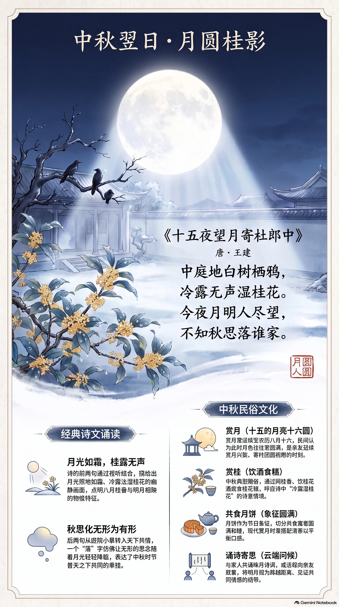

**唐·王建** · 中秋节翌日（月圆赏月）

## 诗词全文

中庭地白树栖鸦，冷露无声湿桂花。
今夜月明人尽望，不知秋思落谁家。

## 赏析

农历八月十五、十六前后，正是中秋赏月、思亲的时节。王建这首七绝不从自己直接写起，而是先铺陈庭院夜景：月光照在地面上，洁白如霜；树上栖息着乌鸦；清冷的露水无声沾湿桂花。“地白”“冷露”“桂花”共同构成澄澈、幽静而略带寒意的秋夜画面，也点明了八月桂香与明月相映的中秋物候。后两句由眼前之景转入天下之情：今夜人人都在仰望明月，那么无边的秋思，究竟会落到谁家呢？“落”字化无形为有形，仿佛思念会随着月光、露水轻轻降临人间，含蓄而余味悠长。诗题虽言“十五夜”，但中秋翌日仍常是月色圆满、亲友延续赏月兴致的时段。今日农历八月十六，读此诗既可感受桂影清辉，也能体会中国人借明月寄托团圆、牵挂与祝愿的共同情感。

## 相关风俗

- 中秋赏月常延续至八月十六。民间有“十五的月亮十六圆”之说，实际满月时刻会因天文月相而变化。
- 赏桂是中秋典型雅俗：庭前、园中闻桂香，或饮桂花酒、食桂花糕，以应和诗中“冷露湿桂花”的意境。
- 月饼原是中秋团圆食品，切分共食象征圆满和睦；现代赏月时可搭配清茶，避免过量食用高糖馅料。
- 中秋夜可与家人共诵咏月诗词、远程问候亲友。明月在传统文化中常被视为跨越距离的共同见证。

## 背后的故事

> 这首小诗最耐人寻味处，在于它并未铺陈宴饮、笙歌，只用“栖鸦”“冷露”“湿桂花”写出月下庭院的清寂，末句忽将一己相思推向“人尽望”的天下。题中“十五夜”即农历八月十五中秋当夜，并非中秋翌日；所寄“杜郎中”的身份，反而成为诗史中的一个小谜。

### 作者轶事

- 王建，字仲初，颍川人，大历十年进士。其仕途并不显赫，曾任渭南尉、太府寺丞，后出为陕州司马；传记特别提到他避乱时寓居咸阳原上。这样的经历使他的诗不专写台阁富贵，常能留意宫人、农家、行役者和城中小民的日常声息。 〔史实 · 《唐才子传·卷四》〕
- 王建与张籍齐名，时人称“张王乐府”。二人都以语言晓畅、能写民间情状见长；王建的《宫词》尤多，像从宫墙缝隙里窥见禁苑制度与宫女心事。《十五夜望月》却把这种善写“众人”的眼光移到庭院：不是只说我愁，而是问天下的秋思究竟落在谁家。 〔史实 · 《唐才子传·卷四》〕

### 本事与创作背景

- 题目“十五夜望月寄杜郎中”已说明这是中秋夜遥寄友人的作品。“寄”字决定了末句并非泛泛咏月：诗人本应直说想念杜郎中，却先写人人望月，最后以“不知秋思落谁家”含蓄地把思念寄出。全篇不见书信套语，正是以月光作共同媒介的寄赠法。 〔史实 · 《全唐诗·卷三百零二》〕
- 杜郎中究竟是哪一位杜氏官员，现存题注与传记没有可据的说明。唐人同名者甚多，“郎中”又只是尚书省诸司长官的通称，不能轻率坐实为杜牧或其他著名人物。写作时可保留这一留白：月色清楚，收信人的面目却隐在官名之后。 〔存疑〕

### 时代背景

- 唐代的“郎中”不是后世对郎中的泛称，而是中央官署中的正式职名。尚书省分曹办事，各司有郎中、员外郎，负责具体政务。题中受寄者被称作“杜郎中”，意味着他至少以京官或省曹官身份进入诗人的交游网络；这种只称官名、不详叙履历的题法，也是唐诗赠答的常见简略笔法。 〔史实 · 《新唐书·卷四十六·百官志一》〕
- 王建所处的中唐，科举入仕与幕府、州府辗转并行，文士交游往往跨越京城与外郡。此诗没有直接的政局怨语，所谓“秋思”也不能径解为失意政治；它更像唐代士人以节令月色维系远方友谊的情感格式。正因为对象不在眼前，庭院越静，寄望越远。 〔史实 · 《唐才子传·卷四》〕

### 风土人情

- “十五夜”指农历八月十五的夜晚，即中秋当夜。诗中活动很克制：站在中庭看月，见乌鸦宿树、露水沾花。这不是热闹宴集的正面描写，却恰是古人赏月常有的庭院视角。须注意“冷露”是秋夜寒凉的露水，并不等同于二十四节气中已经固定名称的“寒露”。 〔史实 · 《全唐诗·卷三百零二》〕
- 到北宋，中秋已发展出极具都市色彩的节日夜生活：店家卖新酒，富家装饰楼台，市民争登酒楼玩月，笙歌彻夜可闻。与《十五夜望月》的空庭冷露相对照，尤其能看出王建的取景用心：他有意避开节日喧阗，只留下月光、花木和无人言说的想念。 〔史实 · 《东京梦华录·卷八·中秋》〕

### 民间传说与后世演绎

- “桂花”后来常被读者联想到月中桂树与吴刚伐桂的传说：月中有高五百丈的桂树，吴刚因学仙有过，被罚不断砍伐，而树随创随合。王建诗中写的本是庭院里被秋露沾湿的真桂花，并未明说月宫；但地上桂香与天上明月并置，天然给后世读者留下了由人间庭院通往广寒世界的想象通道。 〔传说 · 《酉阳杂俎·卷一·天咫》〕

### 典故与名物

- “中庭地白”没有必要硬指为某一典故。“地白”是月光铺地、亮如白霜的视觉写法；“树栖鸦”则把本来无声的夜色写得可感。它的妙处在于先用鸦已归巢反衬人未成眠，再以“冷露无声”压低声音，形成由看见月白、听见静寂到感到寒意的层层推进。 〔史实 · 《全唐诗·卷三百零二》〕
- 末句“秋思落谁家”中的“落”字尤其值得细读。秋思本无形，诗人却仿佛把它当作随月光飘降的东西；“谁家”也使原本指向杜郎中的私情扩散为千家万户共有的离愁。此处未见可确指的先秦两汉成典，更适宜视为王建对“月光落地”这一画面的移用和情感化，而非逐字考索出处。 〔存疑〕
