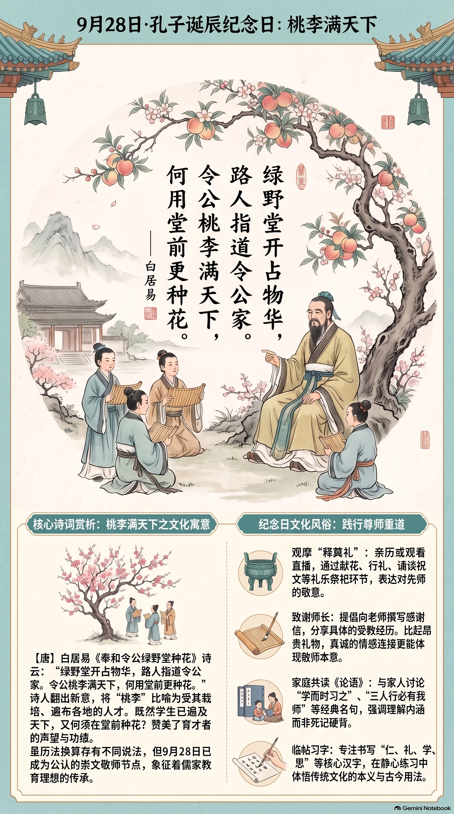

**唐代·白居易** · 孔子诞辰纪念日（9月28日）

## 诗词全文

绿野堂开占物华，路人指道令公家。
令公桃李满天下，何用堂前更种花。

## 赏析

9月28日常被作为孔子诞辰纪念日，在台湾亦定为教师节；虽孔子具体生辰的历法换算历来有不同说法，但这一天已成为崇文敬师的重要文化节点。白居易此诗题赠唐代名相裴度。裴度晚年居于绿野堂，礼贤重士，广育人才。诗人先写绿野堂占尽美好风物，连过路人都能指认这是令公的居所；后两句陡然翻出新意：“桃李满天下”并非庭前实物，而是比喻受其栽培、遍布各地的人才。既然真正的桃李已遍及天下，又何必再在堂前种花？全诗仅二十八字，以花喻人、以景衬德，赞美了育才者的声望与功绩。“桃李满天下”后来成为称颂教师、长者培育后学的固定成语。于孔子诞辰纪念日读此诗，正能体会儒家“有教无类”、薪火相传的教育理想，也提醒人们以真诚的学习和实践来回馈师者。

## 相关风俗

- 可参观孔庙或关注释奠礼直播。释奠礼以礼乐祭祀孔子，常见献花、行礼、诵读祝文等环节，重在表达尊师重道之意。
- 向老师写一封简短感谢信，具体回忆一件受教经历。比起昂贵礼物，真诚说明老师如何影响自己，更贴合敬师的本意。
- 与家人共读《论语》数则，如“学而时习之”“三人行，必有我师焉”，可结合日常学习讨论，避免只背诵而不求理解。
- 可体验临帖或书写“仁、礼、学、思”等字。书写时了解其本义与古今用法，把传统文化纪念转化为安静专注的学习活动。

## 背后的故事

> 这首四句小诗最耐咀嚼处，不在堂前花木，而在“桃李满天下”的转换：裴度的绿野堂本是洛阳显贵园林，白居易却把一场种花雅事写成对宰相知人、育才与延揽名士的颂辞。置于孔子诞辰纪念日诵读，尤其能看出唐人“桃李”如何从果木变成师道与人才的共同语汇。

### 作者轶事

- 裴度在洛阳集贤里营建宅第，又于午桥置别墅，堂名“绿野”。《新唐书》特意写他与白居易、刘禹锡“为文章，把酒穷昼夜”，可见这并非一次疏远的官场应酬，而是东都耆旧以园林、诗酒和文章相往还的生活圈。白诗把“令公家”写得路人皆知，也含有对这位主人声望的熟稔。 〔史实 · 《新唐书·卷一七三·裴度传》〕
- 白居易少年以《赋得古原草送别》谒顾况的故事，最适合说明他后来诗歌的本色：用人人能见的草木起笔，却能转出人事兴亡。顾况先以“长安米贵，居大不易”调侃其姓名，读到“野火烧不尽，春风吹又生”便改口称许。此事虽出笔记，后世常以之概括白诗平易而有警策的路数。 〔传说 · 《唐摭言·卷七》〕

### 本事与创作背景

- 题中“奉和”是唐代唱和诗的格式语，意为恭敬地依原作韵意作答；“令公”所指裴度。裴度绿野堂种花，当有主人原唱或题咏的场合，白居易遂不细写花色、花期，而以末二句骤转，将实景中的栽花提升为培植人才的比喻。这种避实就虚，正是酬和诗中替主人增光的写法。 〔史实 · 《全唐诗·卷四四〇》〕
- 此诗不能仅理解为替一座园子题名。裴度是平定淮西后位极人臣的名相，晚岁又以洛阳园居结纳文士；白居易称其“桃李满天下”，重点在其政治声望与人才网络，而不必坐实为裴度亲授过多少门生。堂前“更种花”的反问，正以园艺的微事映衬人事的丰收。 〔史实 · 《新唐书·卷一七三·裴度传》〕

### 时代背景

- 中晚唐的宰相不只是行政首脑，也常是荐举、奖掖士人的权力枢纽。裴度因参与平定淮西而享有极高政治名望，曾拜中书令；故白居易称“令公”，并非泛称一位地方长官，而是以对宰辅的尊称起势。诗中“路人指道”写的也是一种公共声誉：显宦宅第与主人的功名，在城市记忆中彼此相连。 〔史实 · 《旧唐书·卷一七〇·裴度传》〕
- 唐后期政局屡有藩镇、党争与宦官势力的牵制，退居东都、以园林会友，成为高官保全名节和文化声望的一种方式。绿野堂的宴饮文章并不等于彻底避世：园中聚集的仍是白居易、刘禹锡一类有仕宦履历的文人。因而诗中的闲花并非纯粹闲适，而带着政治人物卸下朝服后仍维系文坛网络的意味。 〔史实 · 《新唐书·卷一七三·裴度传》〕

### 风土人情

- 唐代上层宅园重视植花、凿池、置台榭，花木既供游宴，也显示主人对时令与品位的掌握。白居易自己在《池上篇》中便细数池水、竹木、园圃，将经营私园视作晚年日常。读“绿野堂种花”时，可想见的不是孤零零一畦花，而是堂榭开敞、宾客题诗、仆人浇灌的洛阳园居场景；末句则故意把这份雅趣说得不及育才重要。 〔史实 · 《白氏长庆集·池上篇》〕
- 题设所称9月28日“孔子诞辰纪念日”，属于近现代公共纪念语境，不是这首唐诗原有的节日背景。以此日诵读，宜把“桃李”引向尊师重道，但也应提醒听者：诗中直接被颂扬的是宰相裴度，不是孔子。孔子具体诞日及其换算历来有不同说法，9月28日作为固定纪念日的形成，较晚于唐代。 〔存疑〕

### 典故与名物

- “桃李”代指所培养、提拔的人才，并非白居易临时造语。《韩诗外传》以春种桃李，夏可得荫，秋可食实，对比种蒺藜终受其刺，原本已把树木写成施政者取人与用人的譬喻。白诗以“满天下”夸张其成果，便使裴度从园林主人变作广植人才的政治长者。 〔史实 · 《韩诗外传·卷七》〕
- “桃李满天下”又可与狄仁杰语相参照。武则天问谁可用，狄仁杰答称天下桃李都在“公门”，意谓朝廷可用之才已由君主或执政者培育、搜罗。白居易未必专指此一故事，但唐人以“桃李”“公门”连缀人才与权力的修辞传统已经成熟；此处的“天下”遂不只是学生遍布，更有门生故吏、受知之士遍布四方的气象。 〔史实 · 《资治通鉴·卷二〇四》〕
- “令公”容易被现代读者误作“某县令家的老爷”。在唐代语境中，它常用来尊称位居宰辅的中书令等高官。裴度确曾拜中书令，白居易以此称之，既合官衔，也保持唱和诗应有的恭敬距离。首句的“绿野堂”与次句的“令公家”并置，正把私人园第和国家重臣的身份牢牢扣在一起。 〔史实 · 《旧唐书·卷一七〇·裴度传》〕
