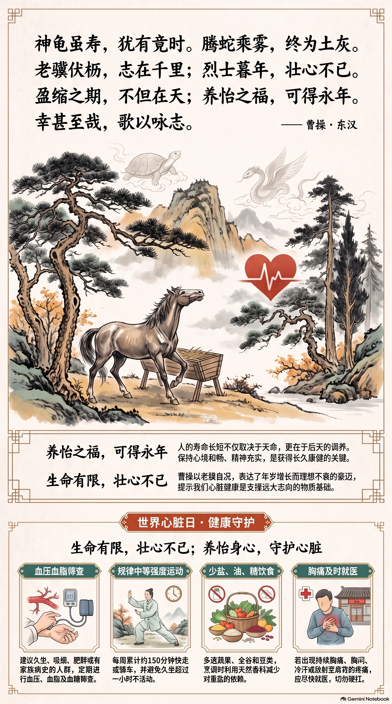

**东汉·曹操** · 世界心脏日

## 诗词全文

神龟虽寿，犹有竟时。
腾蛇乘雾，终为土灰。
老骥伏枥，志在千里；
烈士暮年，壮心不已。
盈缩之期，不但在天；
养怡之福，可得永年。
幸甚至哉，歌以咏志。

## 赏析

9月29日是世界心脏日，旨在提醒人们关注心血管健康。曹操《龟虽寿》中“壮心不已”的“心”，虽主要指志向与精神，却恰可与这一现代健康纪念日相呼应。诗先写神龟、腾蛇，即使被赋予长寿或腾云的神异形象，终究也逃不过生命的限度；继而笔锋昂扬，以伏在马槽边的老骥自况，写出年岁增长而理想不衰的豪迈。后四句尤其富有朴素的生命哲理：人的寿命长短固有天命因素，却并非只能消极等待；调养身心、安顿情志，也有助于获得长久康健。这里的“养怡”不仅是保养身体，更包括保持心境和畅、精神充实。诗歌将对生命有限性的清醒认识，与不甘衰颓的进取意志融为一体。今天读来，它提醒我们：珍视心脏健康，不只是延长岁月，更是为了在有限生命中保持活力、志趣与行动力。

## 相关风俗

- 世界心脏日可安排一次血压、血脂和血糖筛查，尤其适合久坐、吸烟、肥胖或有家族病史的人群。
- 日常可坚持快走、骑车等中等强度运动，每周累计约150分钟，并避免久坐超过一小时不活动。
- 饮食宜少盐、少油、少糖，多选蔬果、全谷和豆类；烹调时可用天然香料减少对重盐的依赖。
- 若出现持续胸痛、胸闷、明显气短、冷汗或放射至肩背的疼痛，应尽快就医，不宜自行硬扛。

## 背后的故事

> 《龟虽寿》最耐人寻味处，不是单纯的“励志”，而是曹操在北征乌桓、登临碣石的归途中，把神龟、腾蛇也终有尽时的古老观念，转成对衰老的正面迎击。诗中“养怡之福”尤其值得细读：它既承认寿命有限，又拒绝把人的精神与功业完全交给天命。

### 作者轶事

- 曹操并非在安稳的宫廷中感叹迟暮。建安十二年，他亲率大军北击乌桓，出卢龙塞，至白狼山大破蹋顿；归途所见沧海、碣石，成为《步出夏门行》组诗的苍茫背景。一个五十余岁的统帅在塞外写“老骥伏枥”，其“老”是实感，却不是退意。 〔史实 · 《三国志·魏书一·武帝纪》〕
- 曹操晚年曾预作遗令，要求葬地从薄，不藏金玉珍宝，并令后宫无子者返家、可自谋婚嫁。这种近乎军令式的节制，与诗中不向神仙寿命乞求、而强调“养怡”的口吻可以互相映照：他关心的不是不死，而是有限岁月中的意志与安排。 〔史实 · 《三国志·魏书一·武帝纪》〕

### 本事与创作背景

- 《龟虽寿》是《步出夏门行》四章之一，前三章为《观沧海》《冬十月》《土不同》；四章以“幸甚至哉，歌以咏志”收束，显示它原是可被配乐演唱的组歌。传统多将全组系于北征乌桓后经碣石的旅程，但现存正史没有“某日作此诗”的直接记录，故只能定为建安十二年前后。 〔存疑 · 《乐府诗集·卷三十九·相和歌辞十四》〕
- 诗的推进很有曹操式的决断：先列举神龟、腾蛇尚且难逃终竟，似乎把死亡说到无可回避；继而忽然转出“老骥伏枥”“壮心不已”。这不是否认衰老，而是把生命问题从“能活多久”改写为“尚能做什么”，适合置于远征凯旋而天下未定的政治心境中理解。 〔存疑〕

### 时代背景

- 建安十二年仍属东汉名义之下，但朝廷实权已集中于曹操。汉献帝在许都，曹操以司空、丞相等身份经营北方；乌桓既为北边劲敌，又与袁氏残余相联。北征的胜利不只是边塞战功，也意味着曹操向统一北方迈出关键一步，故诗中的“千里”有个人志向，也有天下尺度。 〔史实 · 《三国志·魏书一·武帝纪》〕
- 所谓“烈士”，在汉魏语境中主要指有志节、有功业抱负的男子，并非现代语境专指为国牺牲者。曹丕论建安作者，特别标举其文章“慷慨”，正与战乱、仕进和功名交织的时代气质相关。曹操自称“烈士”，是把自己置入尚功业、重气节的士人传统，而非作悲情自悼。 〔史实 · 《典论·论文》〕

### 风土人情

- 龟在先秦两汉并不只是长寿动物，更是占卜礼制中的重要灵物。国家与贵族取龟甲灼兆，以问征伐、祭祀和吉凶；因此“神龟”同时带有灵验、通神与长生的想象。曹操偏说它“犹有竟时”，等于先压低一切神异保障，给后文的人事努力腾出位置。 〔史实 · 《周礼·春官·龟人》〕
- “幸甚至哉，歌以咏志”不宜只按现代书面诗理解为突发感叹，它是乐府歌辞中提示演唱、收束段落的程式语。《步出夏门行》四章皆以近似句法煞尾，像在宏阔叙景和议论之后落下一记歌唱的节拍。朗诵时保留这层音乐性，才不至于把全诗读成孤立的格言。 〔史实 · 《乐府诗集·卷三十九·相和歌辞十四》〕

### 典故与名物

- “神龟”并非曹操凭空创造。古书常以灵龟为能知吉凶、寿命绵长的异物，《庄子》写楚国神龟宁愿“曳尾于涂中”，正体现其神异身份。不过《龟虽寿》的完整句式未必直接出自《庄子》；曹操更像借用了一个当时人人能懂的长寿象征，再故意揭出其寿命仍有边界。 〔史实 · 《庄子·秋水》〕
- “腾蛇乘雾”与《淮南子》“腾蛇游雾而殆于蝼蚁”的说法极近。腾蛇本是能乘雾升腾的神异之物，却仍可能困死于微小的蝼蚁；曹操把这种强烈反差压缩为“终为土灰”。神物的飞腾和尘土的归宿并置，为“烈士暮年”的转折预先建立了逻辑。 〔史实 · 《淮南子·览冥训》〕
- “盈缩之期”中的“盈缩”原有月体圆缺、伸展收敛之义，在诗中转指人的寿夭与命运消长。“不但在天”并非说人能彻底战胜天命，而是反对将寿命完全归结为天定；紧接的“养怡之福”所指，大致是保养身心、使意志安适。它接近汉魏养生语言，但难以确证单一典源。 〔存疑〕
