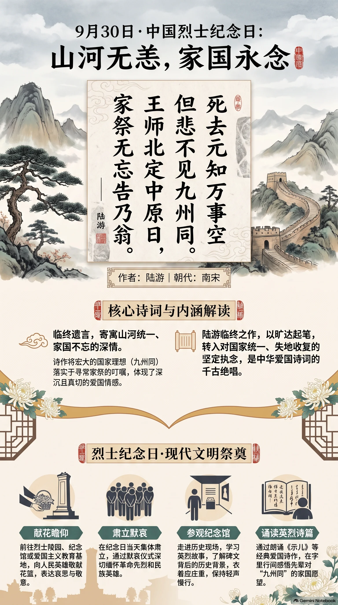

**南宋·陆游** · 中国烈士纪念日

## 诗词全文

死去元知万事空，但悲不见九州同。
王师北定中原日，家祭无忘告乃翁。

## 赏析

9月30日是中国烈士纪念日，适合以陆游《示儿》寄托对家国、先烈与民族记忆的敬意。此诗写于诗人临终之际，篇幅极短，感情却沉郁深厚。“死去元知万事空”先以旷达口吻说人生终归归于空寂；紧接着“但悲不见九州同”陡然转入全诗核心：诗人唯一不能释怀的，是山河未复、国家未能统一。“王师北定中原日”表达他对收复失地的坚定信念，“家祭无忘告乃翁”则把宏大的国家理想落在寻常家庭祭祀的叮嘱上，格外真切动人。诗中没有激昂的铺陈，却以临终遗言的形式凝聚出深沉的爱国情感。用于烈士纪念日阅读，更能体会个人生命虽有限，守护山河、追求民族团结与和平的精神可以代代相传。

## 相关风俗

- 烈士纪念日当天，各地常举行向人民英雄敬献花篮仪式，集体肃立默哀，表达对革命先烈和民族英雄的缅怀。
- 可到烈士陵园、纪念馆或爱国主义教育基地献花瞻仰；参观时宜衣着庄重、轻声缓行，不在纪念设施前嬉闹拍摄。
- 家庭可结合祭扫或亲子共读，了解本地英烈故事，并向孩子讲解姓名、碑文和历史背景，让纪念成为具体的记忆。
- 学校与社区常组织诗歌诵读、主题团日或观看史料活动；可朗诵《示儿》，讨论诗中“九州同”所寄寓的家国愿望。

## 背后的故事

> 这首仅二十八字的绝笔诗，最耐人寻味处不在“悲壮”二字，而在它把国家版图、家族祭祀和父子私语缝在了一起：陆游明知身后万事皆空，却把一则本应在灵前低声禀告的家祭之语，化作对“王师北定中原”的最后催促。置于烈士纪念日朗诵，更能看出它由遗民心事转为公共记忆的过程。

### 作者轶事

- 陆游二十九岁应礼部试，名次本在秦桧之孙秦埙之前；据本传，秦桧因此震怒，到复试时将陆游黜落。这个细节使他的早年仕途从一开始便罩上主和权臣的阴影。后来诗中反复出现的“北伐”“中原”，并非纯粹书斋想象，而与一代士人被压抑的恢复议论相连。 〔史实 · 《宋史·陆游传》〕
- 陆游并非始终闲居作诗。他曾入四川，先后在王炎、范成大幕中任职，也到过抗金前线附近的南郑，亲见军营与边地形势。本传称他“力说张浚北伐”，又记其在蜀中与范成大相忤。晚年退居山阴时，壮志已成旧梦，仍以诗笔保存一个未完成的北伐世界。 〔史实 · 《宋史·陆游传》〕

### 本事与创作背景

- 《示儿》编在《剑南诗稿》卷八十五末段，属于陆游生命最后阶段的作品。“死去元知万事空”先作彻悟式的收束，随即以“但悲”翻转：他不为个人功名、丧乱家计留下遗憾，只以国土未一为憾。题目是给儿子的家常嘱咐，语气却像一份交给后人的政治遗言。 〔史实 · 《剑南诗稿·卷八十五》〕
- 诗常被称作陆游“绝笔”，但应保留一点文献上的分寸：它确为晚年作品，且文字明言身后家祭，极像临终嘱托；不过现存诗集未附“某日临终作”的小序，不能把后世概括的“绝笔”误说成有现场记录的口授遗言。它的力量恰在于这种预先安排身后祭告的冷静。 〔史实 · 《剑南诗稿·卷八十五》〕

### 时代背景

- 南宋建炎以后，朝廷退守江南，中原大部长期处于金朝控制之下。“九州同”因此不是抽象的天下大同，而是对靖康覆亡后南北分裂的直接回应。宁宗朝韩侂胄发动开禧北伐，旋即失利；陆游作此诗前后，恢复事业已从现实军政方案重新沉入老人的遗愿，故“王师”二字格外沉痛。 〔史实 · 《宋史·宁宗本纪》〕
- 在今日中国烈士纪念日的场景中，此诗常被用作爱国教育文本，但需辨明历史层次：陆游不是为某一场近现代战争中的烈士而作，而是南宋遗民式的统一愿望。2014年全国人大常委会将9月30日设为烈士纪念日，安排在国庆日前夕；现代纪念仪式由此赋予“九州同”以国家统一、牺牲纪念的公共含义。 〔史实 · 《全国人民代表大会常务委员会公报·关于设立烈士纪念日的决定》〕

### 风土人情

- “家祭无忘告乃翁”落在中国宗法礼俗最日常的一幕：子孙于家庙或堂前祭祖，陈设酒食，焚香奠献，并以祝辞告知亡者家事。朱熹《家礼》把祭祀程序写得极细，强调主人、祝者与参祭子弟各有位置。陆游把宏大的收复消息设想为祭告内容，正是以家庭礼仪承接国家大事。 〔史实 · 《朱子家礼·祭礼》〕

### 典故与名物

- “九州”本指古代传说及经典地理中的九个区域。《尚书·禹贡》叙禹治水后分别九州，后世遂常以“九州”代称整个中国。陆游不用较中性的“天下”而说“九州”，既有山河版图的质感，也暗含一个本应完整而今被割裂的共同体；“同”即重新归于一统。 〔史实 · 《尚书·禹贡》〕
- “王师”是奉天子之命出征的军队，并不泛指一切武装。《诗经·小雅·六月》写“王于出征，以佐天子”，其中的王命、王师观念构成后世正统军事语言。南宋虽偏安江左，陆游仍称其军为“王师”，是承认宋廷为天下正统；“北定”二字则把军事行动写成恢复旧疆的正义之举。 〔史实 · 《诗经·小雅·六月》〕
- “乃翁”不是庄严的庙堂称谓，而是父亲对儿辈的口语式自称，可直译为“你们的父亲”。它使末句避免了遗嘱的板滞：老人仿佛已在灵位之后，仍等着孩子祭时俯身报告。全诗前三句的“九州”“中原”“王师”皆属国家大词，到“乃翁”忽然缩为一家一人的称呼，反而更见悲情。 〔史实 · 《剑南诗稿·卷八十五》〕
