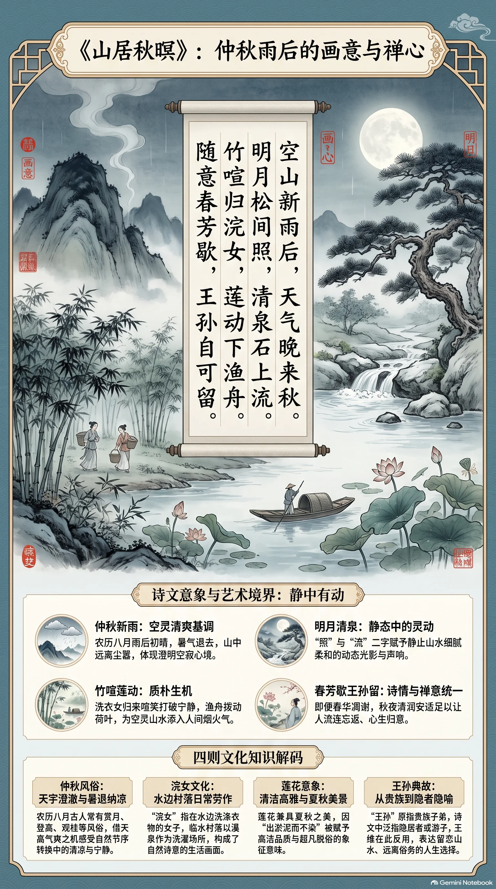

**唐·王维** · 仲秋新雨后的山居清赏

## 诗词全文

空山新雨后，天气晚来秋。
明月松间照，清泉石上流。
竹喧归浣女，莲动下渔舟。
随意春芳歇，王孙自可留。

## 赏析

农历八月已入仲秋，天高气爽，正适合读这首雨后山居诗。诗从“新雨”写起：山中仿佛空寂，并非毫无人迹，而是远离尘嚣、心境澄明。首联点出雨后傍晚的清凉秋意；颔联以明月、松影、清泉、石面构成明净而有层次的画面，“照”“流”二字使静景含有灵动。颈联忽然传来竹林喧笑，又见莲叶轻摇，原来是浣衣女子和归舟渔人，为山林添入质朴温暖的生活气息。末联借“王孙”典故表达诗人的选择：即使春花凋歇，秋山依然足以令人流连。王维善于把绘画般的构图、音乐般的节奏和禅意般的宁静融为一体；此诗也告诉我们，秋日并不只是萧瑟，雨后月下的清润、生机与安适，同样值得细细体会。

## 相关风俗

- 农历八月处于仲秋，古人常在此时赏月、登高、观桂，感受天宇澄澈与暑气渐退的清凉。
- “浣女”指在水边洗涤衣物的女子。古代临水而居的村落常以溪泉为洗濯场所，形成日常劳作景观。
- 莲在传统文化中兼具夏秋之美，既可入诗入画，也常因“出淤泥而不染”被赋予清洁高雅的象征意味。
- “王孙”原指贵族子弟，诗文中常泛指隐居者或游子。王维借此表达留恋山水、远离俗务的心愿。

## 背后的故事

> 《山居秋暝》最耐人寻味处，不只在一幅雨后山水：王维把“浣女归、渔舟下”的人间声息安放进空山明月，又在结尾故意反转《楚辞》劝游子归来的“王孙”旧语。它很可能关联辋川隐居生活，却没有可靠题记能把它钉死在某一年某一日。

### 作者轶事

- 王维字摩诘，名与字合为“维摩诘”，天然带着佛教意味。他的母亲崔氏长期亲近禅僧大照，王维兄弟亦笃信佛法。史传所见的王维，既是能中进士、历任官职的士人，又常以焚香、禅诵自处；这种出仕而内求澄静的性格，使他的山水不只是游赏，也像一种安顿心神的功课。 〔史实 · 《旧唐书·卷一百九十下·王维传》〕
- 王维在蓝田辋川拥有别墅，那里有孟城坳、华子冈、欹湖、竹里馆等景点；他与诗人裴迪逐处游览、唱和，后来形成《辋川集》。辋川并非全然与世隔绝的荒山，而是长安东南近郊一处可往返京城的庄园世界：有山林、泉石，也有僮仆、农渔和来访的文士。 〔史实 · 《旧唐书·卷一百九十下·王维传》〕

### 本事与创作背景

- 此诗没有序文、题注或同时人记录说明“为何而作”。题目只说“山居秋暝”，正文以新雨、晚秋、松月、石泉组织视线，再由竹林人声和莲叶摇动带出归浣、下渔的动态。因此可确认它写的是一次经过艺术经营的秋山暮景，不能据此断言是赠人诗、应制诗，或某次罢官后的即时感怀。 〔史实 · 《全唐诗·卷一百二十八》〕
- 后世常把它直接称作“辋川诗”。这一判断颇合王维在蓝田有别业、喜写山居的经历，诗中竹、莲、泉石也确与辋川诸景相近；但现存诗题没有“辋川”二字，王维也未留下自注。写作时地宜表述为“可能与辋川山居经验有关”，不宜把它当作可精确定位的辋川实录。 〔存疑〕

### 时代背景

- 盛唐士人的生活常在朝廷仕进与郊墅清游之间摆动。王维早年登第，后来又官至尚书右丞；蓝田别业正提供了一个离京不远、却足以模拟隐逸的空间。“空山”因此未必意味着无人烟，而更像暂时摆脱朝市喧阗后的主观感受：山中仍有洗衣女子、渔人和舟楫，只是他们没有破坏诗人的清寂。 〔史实 · 《旧唐书·卷一百九十下·王维传》〕
- 王维一生横跨开元、天宝与安史乱后。长安陷落时他被叛军拘执并授伪职，乱平后虽获宽宥，仕途与心境都不可能毫无波折。不过《山居秋暝》没有战争、贬谪或官场词语，不能硬说它是乱后避世宣言。诗的平和更适合理解为唐代山水诗以可居、可游之境消解尘虑的审美选择。 〔史实 · 《旧唐书·卷一百九十下·王维传》〕

### 风土人情

- “竹喧归浣女”写的是山村傍晚的劳作节律。“浣”即洗涤衣物，溪泉边洗衣本是女性常见的日常劳动；诗人没有正面描摹人影，先听到竹林间的笑语、脚步和枝叶摩擦声，才让读者想见结伴而归的浣女。“莲动下渔舟”亦同此法：先见荷叶分开、摇曳，再知小舟顺流而去，生活声响被纳入景物。 〔史实 · 《说文解字·水部》〕

### 典故与名物

- 末句“王孙自可留”最重要的出处是《楚辞·招隐士》：“王孙兮归来，山中兮不可久留。”原辞站在招隐者立场，劝久游山中的王孙归返；王维却说春花纵然凋歇，王孙仍可留下，把“不可久留”翻成“自可留”。一个小小的改写，使秋山不再是暂借之地，而成为足以安身的理想居所。 〔史实 · 《楚辞·招隐士》〕
- “王孙”本指王族子弟或贵游公子，在《楚辞》传统中又常成为被招唤的游子、隐者的文学习称。王维诗中未必自称贵族，更像借用这一古典角色，与前句“春芳歇”相对：即使草木由荣而衰，也不必像《招隐士》中的王孙那样急于出山。这里的“留”，因而兼有赏景、避喧与自我劝慰三层意味。 〔史实 · 《楚辞·招隐士》〕
