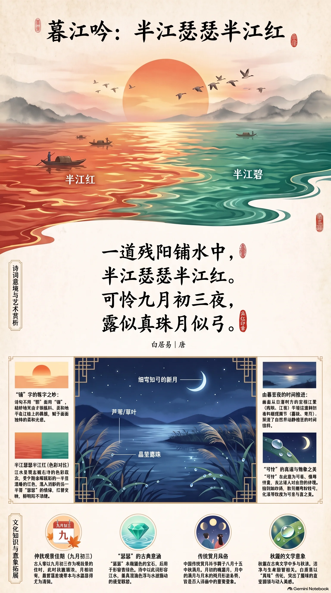

**唐·白居易** · 仲秋江畔晚景

## 诗词全文

一道残阳铺水中，半江瑟瑟半江红。
可怜九月初三夜，露似真珠月似弓。

## 赏析

农历八月已近深秋，天高气爽，正适合读这首写江上暮色与初夜清景的小诗。前两句从落日写起：“铺”字不用“照”字，写出夕阳低斜、柔和地平展在江面的质感。江水一半映着晚霞，呈现温暖的红色；另一半已浸入阴影，泛出“瑟瑟”的碧色，红绿交映，色彩鲜明而不浓艳。后两句将目光由江面转向夜空与草木：露珠圆润明亮，如珍珠散落；新月细弯，如一张轻巧的弓。诗人没有抒发激烈情感，只以细致观察串联夕照、江波、露珠和弯月，便营造出清新宁静的秋夜氛围。“可怜”在这里是可爱、值得怜赏之意，透露出诗人对寻常自然景物的珍惜。全诗语言浅近，画面层次却很完整：由日落到月出，由宏阔江景到微小露珠，展现了唐诗以少胜多、情景交融的艺术魅力。

## 相关风俗

- 古人常以“九月初三夜”作为观察秋景的佳时，秋露渐浓、月相初弯，晨昏温差也使草木与水面更显清润。
- “瑟瑟”原可指碧色宝石，后也常形容青绿色。诗中“半江瑟瑟半江红”因此兼有色泽与水波微动的联想。
- 中国传统赏月并不限于八月十五。月初的娥眉月、月中的满月、月末的残月，均因形态不同而常入诗画。
- 露珠在古典文学中常关联秋凉、洁净与短暂。白居易以“真珠”比露，突出其圆润晶莹，化清寒为可亲可赏之美。

## 背后的故事

> 《暮江吟》最耐人寻味处，在于它看似只是四句江景，实把一天中最短促的光线变化写成了层层递进的画面：残阳斜铺，江面分色，露珠凝圆，新月如弓。通行说法多系于白居易赴杭州刺史任途，但诗中并未点明江名；尤其“九月初三”并非通常所谓八月十五“中秋夜”，不宜把它简单坐实为某一处名胜的秋游图。

### 作者轶事

- 白居易字乐天，晚年自号香山居士；他的仕途并非一路平顺。元和十年，他因上书论宰相遇刺等事触忤权要，由京官贬为江州司马。后来写给元稹的信中回顾这段经历，说自己“终得罪于文章”，可见其对政治文字与个人命运关系的警觉。江州时期的江湖经验，也使他尤善捕捉水面、夜色和行旅中的细小光景。 〔史实 · 《白居易集·卷四十五·与元九书》〕
- 白居易与元稹相交极深，二人以新乐府诗相倡和，不只讲究辞采，更主张诗应“为君、为臣、为民、为物、为事而作”。不过《暮江吟》没有议论与讽谏，近于他所谓“闲适诗”的一路：将政治生活暂时退到画外，以精确而不艰涩的日常语言，保存一瞬可感的自然之美。 〔史实 · 《白居易集·卷四十五·与元九书》〕

### 本事与创作背景

- 此诗题作《暮江吟》，正文只交代“九月初三夜”，未署江名、地名，也没有赠答对象或序文。因此，能确知的是它写暮江至初夜的连续观景；至于究竟在长安附近、赴任舟次，还是杭州境内所作，单凭诗句并不能断定。它的高明恰在不钉死地点，使一江晚色成为可供读者进入的公共景象。 〔史实 · 《白居易集·卷二十·暮江吟》〕
- 通行年谱多将此诗系于长庆二年白居易由京赴杭州刺史任的途中：他当年七月授杭州刺史，秋间南行，诗中的江行暮色因而常被理解为宦游途次所得。但这一说法主要是结合履历与时令作出的系年，并无白居易自注可作最后证据；写作素材中宜称“通常系于赴杭途中”，不宜断言为钱塘江实景。 〔存疑 · 《白居易年谱·长庆二年》〕

### 时代背景

- 唐穆宗长庆二年，白居易由朝廷外放为杭州刺史。唐代刺史是州级长官，既须处理赋役、狱讼，也需维系地方教化；赴任并不等于今日意义的单纯旅行，而是一次携家属、吏员或随从南下的官员迁转。诗里没有职事压力的痕迹，反倒显示出一位长期在政治升沉中周旋的官员，在行程间隙获得的短暂松弛。 〔史实 · 《旧唐书·卷一百六十六·白居易传》〕
- 中唐以后，诗歌中的“江”常不仅是地理名词，更是离开京城秩序、进入舟行与外任生活的空间。白居易曾任江州司马、忠州刺史，后又守杭州、苏州，对水路和州郡生活并不陌生。《暮江吟》不用雄浑的山河话语，只写阳光、江色、露珠、月牙，正符合中唐闲适诗由宏大功业转向可居可游之日常感受的倾向。 〔史实 · 《旧唐书·卷一百六十六·白居易传》〕

### 风土人情

- “九月初三”是农历日期，和通常专指八月十五的“中秋夜”并不相同。依《礼记·月令》的季节名目，农历七月为孟秋、八月为仲秋、九月为季秋；若依十二月建，九月又已称孟冬。故将此诗场景概称为“仲秋江畔”并不严谨，更贴切的说法是深秋或九月初的江上晚景。诗人写的是初月，不是满月赏月。 〔史实 · 《礼记·月令》〕
- 诗中观景次序颇合行旅经验：日落前，斜阳以低角度照水，静水与波纹反光不同，便容易显出红、青两片；入夜后气温下降，草木与舟栏附近凝露，抬头又恰见月初上。这不是铺陈四种静物，而是从傍晚到初夜的一段时间镜头。“露似真珠”也说明诗人的视线已从开阔江面收至近处细物。 〔史实 · 《白居易集·卷二十·暮江吟》〕

### 典故与名物

- “瑟瑟”在这里不作寒颤声解，而指青碧、深绿一类颜色。唐人又以“瑟瑟”称西域传入的青色宝物，段成式记其产自波斯，色泽莹澈。因此“半江瑟瑟半江红”并非说半条江在发抖，而是把背阴或未受残照处的水色，写成近似青宝石的幽碧；“铺”字则写出斜阳平贴水面的柔和光感。 〔史实 · 《酉阳杂俎·卷十·物异》〕
- “真珠”是古代对天然珍珠的常用称谓，圆润、明亮而带微光；露珠在叶面或栏杆上凝结时，正有这种颗粒感。“月似弓”写的是农历月初的娥眉新月，弯而不满。末句将近景的露与远景的月并置，一圆一弯、一低一高，既是比喻，也是极有节制的构图。 〔史实 · 《白居易集·卷二十·暮江吟》〕
- “可怜”在唐诗语境中常可作“可爱”“值得怜赏”解，不能径直译成现代汉语中带哀伤意味的“可怜”。此句真正的情绪落点不是悲秋，而是惊喜：九月初三本是极寻常的一夜，却因露珠与新月同时入眼而显得格外可爱。理解这一层，才能避免把全诗读成羁旅愁苦之作。 〔史实 · 《白居易集·卷二十·暮江吟》〕
