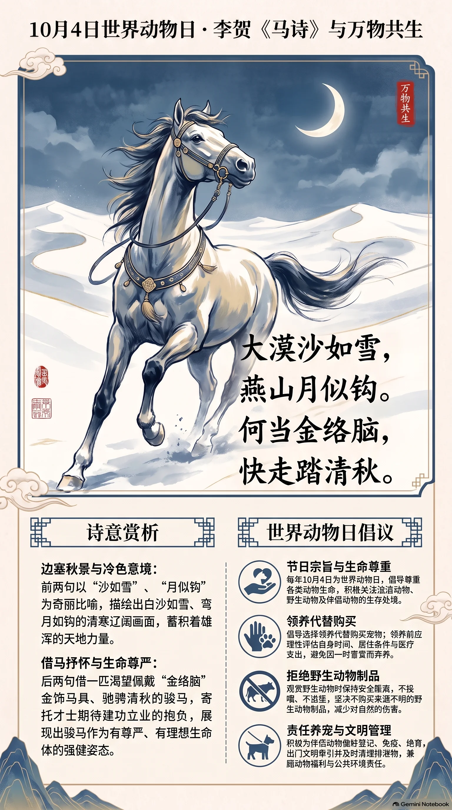

**唐·李贺** · 世界动物日

## 诗词全文

大漠沙如雪，燕山月似钩。
何当金络脑，快走踏清秋。

## 赏析

10月4日是世界动物日，旨在唤起人们对动物生存、福利与人与自然关系的关注。李贺《马诗二十三首·其五》虽非专为今日而作，却以“马”为核心意象，最能与这一主题相呼应。前两句写边塞秋景：大漠白沙在月色下如雪，燕山弯月形似银钩，画面清寒、辽阔，也烘托出骏马所处的雄浑天地。“沙如雪”“月似钩”既是奇丽比喻，又以冷色调蓄积力量。后两句由写景转入抒怀：诗人借一匹期待佩戴金饰马具、驰骋清秋的骏马，寄寓自己渴望被赏识、建功立业的愿望。马在诗中不是静止的观赏对象，而是有生命力、有尊严、有奔腾理想的伙伴。今天重读此诗，也可体会古人对动物强健姿态的赞美，并进一步理解：真正的尊重，不只是利用动物的力量与美，更应珍惜其生命，维护人与万物和谐共生的环境。

## 相关风俗

- 世界动物日定于每年10月4日，倡导尊重各类动物生命，关注流浪动物、野生动物及伴侣动物的生存处境。
- 可选择领养代替购买宠物；领养前应评估时间、居住条件与医疗支出，避免因一时喜爱而弃养。
- 观赏野生动物时应保持距离，不投喂、不追逐、不购买来源不明的野生动物制品，共同减少伤害。
- 为宠物做好登记、免疫、绝育和文明牵引，及时清理排泄物，是兼顾动物福利与公共环境的负责做法。

## 背后的故事

> 这首小诗最耐人寻味处，在于它并非单纯咏马：李贺把“沙如雪”“月似钩”的冷峭边塞，压缩成一匹尚未披上金饰、却已渴望纵蹄的马。联系他因父名触讳而不得应进士、长期困于微官的经历，“何当”二字常被读作少年才士等待机会的急切自白；但这层寄托终究是从诗意推得，不能当作已被史料坐实的本事。

### 作者轶事

- 李贺出自唐宗室郑王一支，却没有享到宗室子弟的顺遂。他少年以辞章知名，准备应进士时，因父名“晋肃”中的“晋”与“进”音近，被有司援引避讳之说阻拦。韩愈特作《讳辨》为其申辩，仍未能挽回。诗中那匹等待“金络脑”的马，因而容易令人联想到一个门第尚在、仕路却骤然受阻的青年。 〔史实 · 《新唐书·李贺传》〕
- 李商隐所记的李贺形象很有画面：他常骑一头瘦驴，令小童背着破锦囊随行，遇到句子便随手写下投入囊中；傍晚归家，母亲倒出满囊诗稿，叹他几乎要“呕出心”来。这个故事未必能逐日实录，却说明晚唐人已把李贺视为苦吟、奇思逼人的诗人；《马诗》的雪沙、钩月，也正是这种炼字式的骤然显影。 〔传说 · 《李商隐集·李长吉小传》〕

### 本事与创作背景

- 《马诗二十三首》是一组以马为题、句法短促而意象各异的五言绝句；其五先展现空阔寒冷的北地，再忽然转入“何当”二字的愿望。现存文本只保存诗题与组诗次第，没有序文交代它写于何处、赠与何人，不能坐实为一次从军、游燕或具体求仕事件的纪念。写作时宜保留它的开放性，而不要替李贺虚构一场边塞经历。 〔史实 · 《李长吉歌诗·卷一》〕
- 历来常把“金络脑”视作功名、任用的象征，把末句读成怀才者盼望施展的自况：马须先蒙装饰与驾驭，才可以踏遍清秋。此说与李贺应举受挫的经历颇能互照，但诗内没有“我”“仕”“荐”等明证，亦可能只是借良马写边地驰骋的想象。若据此扩写人物心理，宜写成一种可感的文学阐释，而非确定本事。 〔存疑〕

### 时代背景

- 元和时期的唐廷正在重整藩镇与财政、军事秩序，宪宗朝对不受控藩镇多次用兵；朝野对边备、战马和功业的想象并不遥远。李贺笔下的“大漠”“燕山”未必是实地报告，却能借北方边塞的传统语汇，制造一种等待出征、等待建功的张力。冷月如钩与“快走”的热望相撞，正合中唐青年面对仕途与军功时的焦灼想象。 〔史实 · 《旧唐书·宪宗纪下》〕
- 唐代进士科虽声望极高，却并非单凭才名即可入仕；门第、人事、礼法解释都可能左右前途。李贺遭遇的“嫌名”风波尤其尖锐：避父讳本属孝道范围，却被扩大到“进”与“晋”的近音联想。读“何当”时，不妨看到制度性门槛如何把少年人的愿望压缩为四个字：不是已经驰骋，而是尚在等待被装配、被认可的一刻。 〔史实 · 《韩昌黎文集校注·讳辨》〕

### 风土人情

- “金络脑”不是给马随意贴金的玩具，而是以金饰装点马头络具的华贵说法。古代马具包括辔、勒、衔、鞍及冠饰，贵游、仪仗与良马尤其重视其光彩；诗中先说“金”，再说“快走”，便把被珍重、被选用与迅疾奔腾连在一起。它既有实物质感，也天然适合转化为受赏、得志、获用的象征。 〔史实 · 《唐六典·太仆寺》〕
- “清秋”不只是好天气。先秦礼制把秋季与治兵、田猎相联：仲秋教治兵，并举行“狝田”，以演习车骑、整饬武备。唐诗写秋日快马，未必严格遵守周礼月令，却继承了秋高气肃、适宜驰猎和远征的文化联想。因此“踏清秋”有风景之美，也暗含人马俱健、可以试锋的季节感。 〔史实 · 《周礼·夏官司马·大司马》〕

### 典故与名物

- “大漠”在唐诗里往往不等于一处可精确定位的沙漠，而是汉以来北方征战空间的总称。汉武帝时卫青、霍去病远征匈奴，史书称其战场为“漠北”，此后“漠”逐渐凝结为边塞、绝域和军功的文学背景。李贺以“沙如雪”开篇，写的不是温润江南的白沙，而是月下反光、寒意逼人的荒漠质地。 〔史实 · 《史记·卫将军骠骑列传》〕
- “燕山”在诗歌传统中常指燕地北部、接近边塞的山岭，并不必然是作者亲至某座山的地理标记。战国燕国长期面对北方游牧部族，燕将秦开曾北击东胡，相关历史使“燕”天然带有北边防线的色彩。李贺将燕山的月色放在大漠之后，实际是把读者迅速带入汉唐边塞诗早已熟悉的北方舞台。 〔史实 · 《史记·匈奴列传》〕
- “月似钩”的“钩”首先是新月弯曲如钩的视觉譬喻，不宜硬释为兵器或某一专门典故；但它与下一句的“金络脑”形成精巧对照：天上是一弯冷银色的钩，马头将是明亮的金饰，天地间只剩金、银、白、黑的峻利色调。末句“踏清秋”中的“踏”又让静止月色被马蹄声骤然打破。 〔存疑〕
