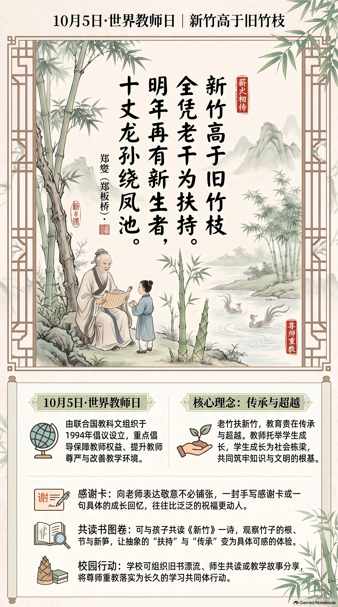

**清代·郑燮（郑板桥）** · 世界教师日

## 诗词全文

新竹高于旧竹枝，
全凭老干为扶持。
明年再有新生者，
十丈龙孙绕凤池。

## 赏析

10月5日是联合国教科文组织确立的世界教师日，旨在关注教师权益、尊严与教育质量。郑板桥这首《新竹》虽写竹，历来却常被视作歌颂师生传承的名篇。诗的前两句以“新竹”与“旧竹枝”作鲜明对照：新竹能够长得更高，并非凭空而来，而是依靠老竹根干的滋养、支撑。这里的“扶持”二字朴实而有力，准确写出前辈对后学的培育之功。后两句把目光推向未来：明年又会有新生的竹笋，茁壮成长，环绕池边，形成蓬勃不息的生命景象。“凤池”本指宫苑池沼，也使竹林带上一层高洁、典雅的意味。全诗不直接谈教育，却以竹的生长规律揭示知识传承的真意：教师托举学生，学生终将超越前人；而教育的价值，正在一代代新生力量不断接续、生长之中。

## 相关风俗

- 世界教师日定在10月5日，由联合国教科文组织于1994年倡议设立，重点倡导保障教师权益、改善教学环境。
- 向老师表达敬意不必铺张：一封手写感谢卡、一句具体的成长回忆，往往比泛泛祝福更真诚动人。
- 可与孩子共读“新竹”一诗，观察竹的根、节与新笋，理解“扶持”与“传承”并非抽象概念。
- 学校可组织旧书漂流、师生共读或教学故事分享，让尊师重教落实为持续的学习共同体行动。

## 背后的故事

> 这首四句小诗最值得玩味处，在于它本非为“教师节”而作，却天然容纳了薪火相传的现代阐释。“老干扶持”先是竹子的生长实景，继而才可被读成师者的栽培；末句“龙孙绕凤池”又把寻常新笋写成有望进入清贵之地的一代新材。郑板桥一生为县令、卖画者、画竹人，这种由民间物象通向人格与前程的笔法，正是其诗画共同的骨气。

### 作者轶事

- 郑燮，字克柔，号板桥，江苏兴化人。乾隆元年中进士，先后任山东范县、潍县知县；本传记其在潍县遇岁饥时开仓赈民，后因忤逆上官罢官。一个长期在州县钱粮、灾荒与讼狱之间周旋的人，写竹便不只是书斋清供：竹干的“扶持”、新生者的向上，也容易带上对困顿生命的体恤。 〔史实 · 《清史稿·卷四百八十四·郑燮传》〕
- 罢官后的郑板桥寓居扬州，以卖书画为生。他在自定的《润格》中明列大幅、小幅、条幅、扇头的收费，并声明馈赠、求题者须付润资。这份近乎市井告白的文字，打破了文人讳言卖艺的姿态；他画兰竹石、题诗于纸绢，也是在把清峭的“君子”意象带进真实的交易和日用世界。 〔史实 · 《板桥全集·板桥润格》〕

### 本事与创作背景

- 《新竹》只以物名为题，诗集文本没有说明它是赠人、应酬、题画，还是某次特定游览的产物。因而不能把“旧竹”坐实为某位老师，也不能把“新生者”指定为郑燮弟子。较稳妥的读法，是先承认它写竹的代际生长：新枝越过旧枝，根本仍在老干的支撑与根系之中。 〔史实 · 《板桥全集·诗钞·新竹》〕
- 诗的转折很有经营：前两句是可见的植物结构，“高于”“扶持”构成向上与承托；后两句忽将明年新笋称作“龙孙”，又让它们围绕“凤池”。因此它并非静物咏叹，而是以竹的年年抽生，铺写后辈超过前辈、却不忘所自的伦理想象。今日用于教师节，正是抓住了这层可延展的比喻。 〔史实 · 《板桥全集·诗钞·新竹》〕

### 时代背景

- 清代读书人的上升通道仍紧系学校、科举与官场。郑燮本人由进士而知县，正是这种秩序中的一员；“凤池”在诗歌语汇里又常连着中枢、清贵与显达。故末句虽未直说功名，却能使当时读者感到：被培植的新材终将环拱于高华之地。它是希望的修辞，不宜径直判作某一政治事件的隐喻。 〔史实 · 《清史稿·卷一百零六·选举志一》〕
- 郑板桥活动的扬州，是盐商财富、园林宴集、书画交易交织的城市。画竹在这一环境中既可寄托文人自守，也能成为可售、可赠、可悬的雅物。郑燮把竹画得瘦硬、题得警拔，并非脱离市场的孤高姿态，而是让一种道德化的植物形象在城市文化消费中格外醒目。 〔史实 · 《扬州画舫录·卷十一》〕

### 风土人情

- 竹笋在江南饮食中极具时令感。李渔称笋为蔬食中的第一品，强调其鲜嫩难久存，宜趁春日新出而食。郑诗所谓“明年再有新生者”，首先也是熟悉的岁时经验：竹林经冬蓄力，春来破土，新笋密集环生。诗人把这份厨房和园林都懂得的鲜活，提升成了世代传承的画面。 〔史实 · 《闲情偶寄·饮馔部·蔬食第一》〕
- 10月5日的世界教师日，是联合国教科文组织与国际劳工组织1966年《关于教师地位的建议》所纪念的现代国际性日期；它与郑燮并无时代关联。将《新竹》用于此日，应视为当代教育场景的再语境化：以“扶持”解释教诲，以“新生者”解释学生，而不应倒推为郑燮原有的节日写作意图。 〔史实 · 《联合国教科文组织·世界教师日》〕

### 典故与名物

- “龙孙”是对竹笋、新竹的美称。“孙”点明它是老竹所生的后代，“龙”则给寻常草木添上腾跃、贵重的想象；与前句“新生者”相应，正把竹林的繁殖关系拟成人世代际。此词在诗文中沿用已久，但就郑诗而言，未必须追定为化用某一单篇前作，更适合当作成熟的咏竹语汇理解。 〔存疑〕
- “凤池”或“凤凰池”在中古以来常被用作朝廷禁苑、宫池以及中书省一类清要机构的雅称；入诗后往往不必实指某一座池子，而借凤凰的瑞祥与池苑的华贵，标示仕进和高门。这里让龙孙“绕”凤池，是把新竹写成环拱成景，也把后起者安放进一个光彩而有前途的空间。 〔存疑〕
- 全诗最容易被忽略的名物是“老干”。竹虽中空而节节分明，新笋实际从地下鞭根及旧丛基部萌发；“全凭”并非严格的植物学说明，却准确抓住成竹与新笋同根相续、旧丛护持新生的观感。郑燮画竹惯重根、干、枝、叶的骨力，这种由物理支撑转为伦理支撑的写法，正与其画学趣味相通。 〔史实 · 《板桥全集·画竹题记》〕
