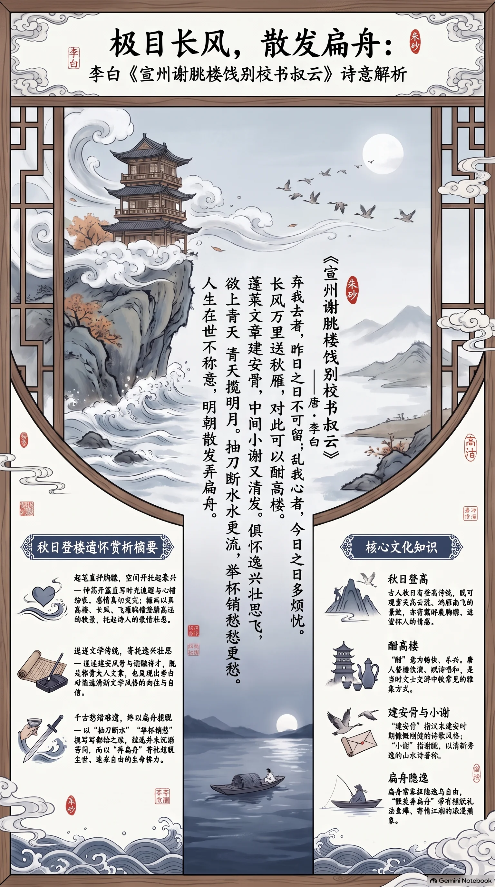

**唐·李白** · 秋日登楼遣怀

## 诗词全文

弃我去者，昨日之日不可留；
乱我心者，今日之日多烦忧。
长风万里送秋雁，对此可以酣高楼。
蓬莱文章建安骨，中间小谢又清发。
俱怀逸兴壮思飞，欲上青天揽明月。
抽刀断水水更流，举杯销愁愁更愁。
人生在世不称意，明朝散发弄扁舟。

## 赏析

时值农历八月下旬，秋高气爽，正适合读这首写秋日登楼的名篇。诗从“昨日不可留、今日多烦忧”起笔，直写时光流逝与心绪纷乱，感情来得极为突兀而真切。接着以“长风万里送秋雁”开出辽阔秋景：高楼、长风、飞雁共同构成澄澈高远的空间，也暂时托起了诗人的豪兴。中间追述建安风骨与谢朓诗才，既是称赞友人文章，也显出李白对俊逸文学传统的向往。“抽刀断水”“举杯销愁”以鲜明比喻说明愁绪难遣，成为千古传诵的名句。但结尾并未沉溺于苦闷，而以“弄扁舟”的想象，保留了超脱尘世、追求自由的姿态。全诗在豪放与忧愤、飞扬与低回之间跌宕起伏，正体现了李白诗歌强烈的生命张力。

## 相关风俗

- 古人秋日常有登高传统，既可观赏天高云淡、鸿雁南飞，也寄寓舒展胸襟、远望怀人的情感。
- “酣高楼”中的“酣”有畅快、尽兴之意。唐人登楼饮酒、赋诗唱和，是文士交游中常见的雅集方式。
- 鸿雁在古典诗词中常关联秋信、离别与思念。雁群顺时南迁的自然现象，使其成为秋天的重要意象。
- “建安骨”指汉末建安时期诗歌的慷慨刚健风格；“小谢”指谢朓，以清新秀逸的山水诗著称。
- 扁舟常象征隐逸与自由。诗人说“散发弄扁舟”，带有摆脱礼法束缚、寄情江湖的浪漫想象。

## 背后的故事

> 这首诗最有张力之处，在于它明明是一次宣州高楼上的饯别，却忽然转成李白对时间、仕途与自由的总清算。被称作“校书叔”的李云，属于掌管典籍校雠的文官；李白以“建安骨”“小谢清发”相许，旋即用“抽刀断水”写出酒不能遣的愁，末尾的扁舟则把一次宴饮推向出世远游的古典想象。

### 作者轶事

- 李白并非始终是“散发弄扁舟”的江湖人。他曾被玄宗召入长安，供奉翰林，得到“赐食、亲为调羹”的优遇；但这种近侍文人的位置并非真正参政，后来他自请还山，玄宗赐金放还。此诗中“人生在世不称意”的激烈，并非单纯秋愁，也有这段仕进幻灭的回声。 〔史实 · 《旧唐书·卷一九〇下·文苑下·李白传》〕
- 贺知章初见李白文辞，曾惊叹其为“谪仙人”；这一称号后来几乎覆盖了李白的历史形象。但《谢朓楼》诗所呈现的李白并不只是飘逸的仙才：他极看重文章的“建安骨”，又因现实不合而欲弃冠服、泛扁舟。仙气与功名心相互拉扯，正是其人格中耐写的一层。 〔史实 · 《新唐书·卷二〇二·李白传》〕

### 本事与创作背景

- 题目已经交代了事件的骨架：地点是宣州谢朓楼，活动是“饯别”，对象是名为李云、官为校书郎而被李白称作“叔”的人。诗中“对此可以酣高楼”“举杯销愁”并非虚设的饮酒意象，而是饯宴现场的动作；前半赞友人文章，后半忽转自伤，使送别成为双方共同的失意之宴。 〔史实 · 《李太白全集·卷十八·宣州谢朓楼饯别校书叔云》〕
- 此诗多编年本系于天宝十二载。这个年份主要由李白在宣州的行踪和作品编次推定，并无一篇同时文书明确记下宴会日期，故不宜把它写成精确到某月某日的“实录”。尤须注意，李云的家世、生平及其与李白究竟是血亲还是以宗族称谓相呼，目前都缺乏可互证的传记材料。 〔存疑〕

### 时代背景

- 若作于天宝十二载，此时安禄山之乱尚未爆发，不能把“乱我心者”直接坐实为战乱。安禄山在天宝十四载方正式举兵；诗中的“烦忧”首先仍是个人性的岁月逼迫、仕途不展与理想无着。不过，开元盛世已渐转入天宝末年的政治阴影，也使这种不称意更具时代的闷热感。 〔史实 · 《旧唐书·卷九·玄宗下》〕
- “校书”不是泛泛的读书人称呼。唐代秘书省负责国家图书、图籍校雠，校书郎、正字等官员承担校勘、雠校之职，品秩不高，却天然带有典册文章的身份光泽。李白称李云“蓬莱文章建安骨”，正是把这位馆阁文官置于国家藏书与文学传统的双重光环中加以褒扬。 〔史实 · 《唐六典·卷十·秘书省》〕

### 风土人情

- 唐人送别并不总在驿道折柳，也常在城楼、江亭、寺阁设席。此诗题作“饯别”，正文又有“酣高楼”“举杯”，可见秋日登临与酒宴交织：楼外是长风秋雁，楼内是觥筹与文章谈。酒在这里原是饯行礼俗的一部分，却被李白写成失败的“销愁”手段，越饮越显心事难平。 〔史实 · 《李太白全集·卷十八·宣州谢朓楼饯别校书叔云》〕
- 末句“明朝散发弄扁舟”中的“散发”，不宜只当作头发蓬乱的写景。古代成人男子通常束发加冠，入仕者尤受服饰礼法约束；李白设想翌日披发泛舟，是有意撤去冠服和官场身份。它与“扁舟”连用，构成一种从城市楼宴、文官秩序中抽身而出的姿态，而未必真是立即成行的生活计划。 〔史实 · 《李太白全集·卷十八·宣州谢朓楼饯别校书叔云》〕

### 典故与名物

- “建安骨”所指并非单一作家，而是汉末建安文学的慷慨悲凉、刚健有力。刘勰论建安文章，称其风格“雅好慷慨”，并联系乱离世局说明其悲壮来源。李白以此赞李云，意在说他的馆阁文章不止于雕饰，而有曹氏父子、建安七子一系的劲骨；“骨”字也预示了李白自己的审美立场。 〔史实 · 《文心雕龙·时序》〕
- “小谢”通常指谢朓，以别于早一辈的谢灵运“大谢”。谢朓曾任宣城太守，故宣州楼名与其相连；其诗以山水清丽、声律精工著称，最适合点染眼前秋高风远的楼头景象。李白把李云文章说成兼有建安之骨与小谢之清发，实是以雄健和清新两种看似相反的美感并举。 〔史实 · 《南齐书·卷四十七·谢朓传》〕
- “蓬莱文章”历来解释不尽一致：蓬莱本是海上仙山，后世注家多认为此处借指藏书、校书之府，因李云任校书而有馆阁意味；也有人着重理解为仙境般的文章才华。诗句并未明说具体宫阁名称，故不必硬指为某一座实有建筑。它的妙处正在把秘书省的典籍世界写得像海上仙山。 〔存疑〕
