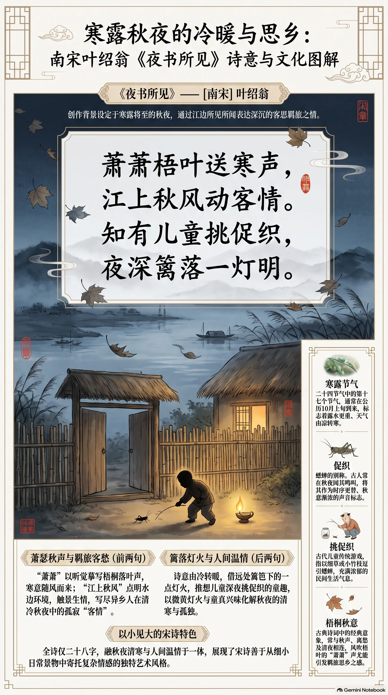

**南宋·叶绍翁** · 寒露将至的秋夜客思

## 诗词全文

萧萧梧叶送寒声，江上秋风动客情。
知有儿童挑促织，夜深篱落一灯明。

## 赏析

今日临近寒露，秋意渐深，正适合读叶绍翁这首写秋夜旅愁的小诗。首句“萧萧”摹写梧桐落叶被风吹动的声音，听觉先于视觉，寒意便自然袭来；“江上秋风”不仅点出水边环境，也使漂泊在外的诗人触景生情。“客情”二字含蓄而有分量，写尽异乡人在清冷秋夜中被风声唤起的孤寂。后两句笔锋一转，诗人由远望见篱笆旁的一点灯火，猜想有儿童在灯下挑弄促织，即蟋蟀。儿童的兴味、微黄的灯光与前面的寒风落叶形成冷暖相映：诗人虽仍身在旅途，眼前却浮现出寻常人家的温暖生活。全诗仅四句，既有秋夜的清寒，也有灯火人间的温情，体现了宋诗善于从细小日常景物中寄托复杂情绪的特点。

## 相关风俗

- 寒露是二十四节气中的第十七个节气，通常在公历十月上旬到来，意味着露水更重、天气由凉转寒。
- “促织”是蟋蟀的别称。古人常在秋夜闻蟋蟀鸣叫，并将其视作时序更替、秋意渐浓的声音标志。
- 古代儿童有斗蟋蟀、观蟋蟀等游戏。“挑促织”指以细草或小竹枝逗引蟋蟀，富有民间生活气息。
- 梧桐在古典诗词中常与秋声、离愁和清夜相连；风吹梧叶的“萧萧”声，尤其容易引发羁旅之思。

## 背后的故事

> 这首小诗最耐人寻味处，不在一盏灯照出“儿童”的温暖，而在诗人刻意不走近：江风、梧叶、寒声先把客子隔在暗处，篱边拨弄蟋蟀的孩子只以灯影可见。它写的是秋夜所见，更借一幅近在眼前而不可参与的乡居图，显出羁旅者的客情。

### 作者轶事

- 叶绍翁，字嗣宗，号靖逸，龙泉人；文献又称其本姓李，后嗣于龙泉叶氏。这样的宗族经历为后人谈论其身世留下线索，但他可考生平远不如陆游、杨万里丰满。传世《靖逸小集》篇幅不大，反而使这位诗人常以几首清峭的绝句被记住。 〔史实 · 《四库全书总目提要·靖逸小集》〕
- 叶绍翁的交游、仕履与卒年，今日都缺少连贯可靠的年谱材料。读《夜书所见》时，最应避免把“客”径直坐实为罢官、避乱或特定政治事件；它首先是古诗中旅人自称的常用身份。诗人的生平空白，恰给这首短诗保留了不被传记锁死的余地。 〔存疑〕

### 本事与创作背景

- 题目“夜书所见”已交代写法：夜中记录眼前景物，而非题赠某人或奉和某作。前两句先听到梧叶与江风，末两句才隔着篱落望见灯火和儿童，观察次序由广阔昏暗的江面收向一户人家。所谓“客情”，正从这层由远及近、而终究不能进入的距离感里生出。 〔史实 · 《靖逸小集·夜书所见》〕
- “寒露将至”可以帮助想象其清冷程度，却不能当作作品的确切时日。诗中只有梧叶、秋风、促织和夜灯四项物候与景物；按传统月令，蟋蟀在秋季由野及户，活动期并不只限于寒露前后。若将此诗写成某年寒露夜作，便是把氛围误作史实。 〔存疑 · 《靖逸小集·夜书所见》〕

### 时代背景

- 南宋诗歌中的“客”未必专指失意官员，也可以是行役、访友、寄寓者。叶绍翁只写“江上秋风动客情”，没有官衔、地名、战事或朝局标记；把秋声一概解释为国破家亡式的悲愤，缺乏文本和本事依据。它更接近江行夜泊时被季候触发的私人愁绪。 〔史实 · 《靖逸小集·夜书所见》〕
- 宋人对八月秋夜的感受，常围绕月色、街市、儿童游嬉与虫声展开，季节并非纯然萧杀。此诗不写城市的热闹，而将视角放在“篱落”一角：同一秋夜，一边是行旅者听风，一边是孩童就灯玩虫。其情绪的微妙，正在于民间日常没有停止，客人的孤单却被照得更清楚。 〔史实 · 《梦粱录·八月》〕

### 风土人情

- “促织”即蟋蟀。古人尤其注意它入秋后的迁移与鸣叫：《诗经·豳风·七月》说“七月在野，八月在宇，九月在户，十月蟋蟀入我床下”。这不是严格的自然观察记录，却说明蟋蟀由野外逼近屋宇，早已是感知秋凉的常识；叶诗把它安在篱边，正合这一经验。 〔史实 · 《诗经·豳风·七月》〕
- “挑促织”通常理解为孩子以细枝、草茎拨弄或逗引蟋蟀，未必就是后来专门化的斗蟋蟀活动。诗人选择“挑”而非“听”，使虫子从纯粹的秋声变成儿童手边可玩的活物。夜深尚不入睡、只借一灯照看，也让篱落人家的秋夜带上顽童特有的专注与兴味。 〔存疑 · 《靖逸小集·夜书所见》〕

### 典故与名物

- “萧萧”是古典秋声的强烈声响词，与《楚辞·九辩》“悲哉秋之为气也，萧瑟兮草木摇落而变衰”的感官世界相通。叶绍翁未必是在逐字用典，但“萧萧梧叶”显然承接了草木摇落、风声满耳的抒情传统；一个“送”字，更像秋声主动送到旅人耳边。 〔史实 · 《楚辞·九辩》〕
- 梧叶在后世常被附会为“一叶知秋”的象征。较早的相近说法见《淮南子》：“见一叶落而知岁之将暮。”不过叶诗写的是“梧叶”在风中萧萧作响，不是凝视单叶落下；可借这一典故丰富秋意，却不宜断言诗人有意化用“一叶知秋”的成语。 〔附会 · 《淮南子·说山训》〕
- “篱落”即篱笆、院落边界，在诗中不是可供游赏的园林陈设，而是视觉与身份的隔断。诗人从江上或旅舍一侧望去，只能辨认篱边的一点灯明，孩子的脸、院中陈设都不可见。末句因此不是全景描写，而像黑暗中偶然被灯火切出的一小块人间。 〔史实 · 《靖逸小集·夜书所见》〕
