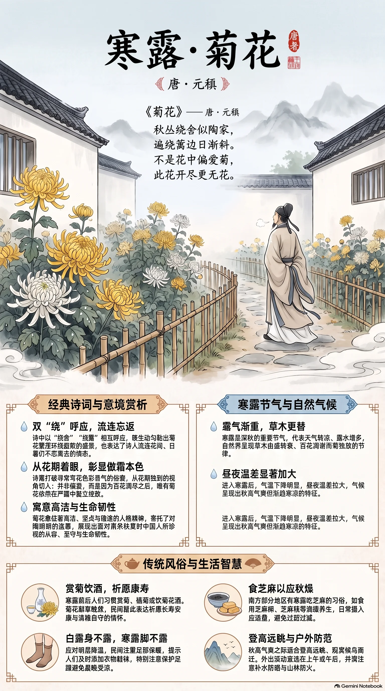

**唐·元稹** · 寒露

## 诗词全文

秋丛绕舍似陶家，遍绕篱边日渐斜。
不是花中偏爱菊，此花开尽更无花。

## 赏析

寒露是深秋的重要节气，露气渐重，草木由盛转衰，正是菊花凌霜开放的时节。元稹这首七绝以极平易的语言写出深厚的爱菊之情。首句说房舍四周菊丛环绕，仿佛陶渊明的田园居所；“绕舍”“绕篱”两个“绕”字相互呼应，既写菊花繁盛，也写诗人流连花间、看遍篱边而不忍离去的情态。后两句不从菊的颜色、香气落笔，而从花期着眼：并非刻意偏爱菊花，只因百花凋尽之后，唯有菊花仍能傲霜吐艳。这样的解释反而更显赞美之深。菊花在传统文化中象征高洁、坚贞与隐逸人格，诗中也隐含对陶渊明的追慕。寒露时节读此诗，既能感受秋意渐浓、花木更替的自然节律，也能体会中国人面对肃杀秋景时所珍视的从容、坚守与生命韧性。

## 相关风俗

- 寒露前后宜赏菊、插菊或饮菊花酒。菊花耐寒晚放，民间借此祈愿长寿安康，也寄托清雅自守的情怀。
- 南方部分地区有“寒露吃芝麻”习俗，可食芝麻糊、芝麻糕等，以应秋燥；日常仍应注意适量，不宜过甜过腻。
- 寒露后昼夜温差明显，民间有“白露身不露，寒露脚不露”之说，宜及时添衣袜、保暖足踝，避免晨晚受凉。
- 此时秋高气爽，适合登高远眺、观候鸟南迁。外出可选择上午或午后，并注意补水、防晒和山林防火。

## 背后的故事

> 这首小诗最耐人寻味处，在于它把一层寻常的篱菊，写成了中唐士人对“余晖”与“守候”的体认。“陶家”并非泛指隐者，而是直指陶渊明东篱采菊的生活想象；末句所谓“不偏爱”，恰以菊花独殿秋深、群芳既歇的时序事实，反衬出格外的珍重。

### 作者轶事

- 元稹少有才名，贞元末登明经第，元和元年又以“才识兼茂、明于体用”制科对策第一，授左拾遗。其后仕途却数经顿挫，曾因触忤权贵出为江陵府士曹参军。这样一位熟悉朝廷升沉的人，笔下的“遍绕篱边”便不只是园居闲步，也容易让人联想到仕途间隙中对安静生活的凝视；但不能据此断定本诗作于贬所。 〔史实 · 《旧唐书·元稹传》〕
- 元稹与白居易齐名，后世合称“元白”。二人以诗文相知，又长期在政治理想、唱和酬答中彼此照映；白居易为元稹所作墓志，尤其追述其早年才气、仕宦经历与相交情谊。读《菊花》时，可将其置于中唐白居易、元稹一派重视日常景物与平易语言的诗风中：不靠冷僻典故，而以近乎口语的转折收束全篇。 〔史实 · 《白居易集·唐故中书舍人元君墓志铭并序》〕

### 本事与创作背景

- 《菊花》收入《元氏长庆集》，但原集此诗前后没有序文、自注，也没有题下注明赠答对象、作地或作年。因此，“寒露”可作为当代阅读时的节令场景：寒露前后菊渐盛、日影渐短，确与诗境相合；却不可把它说成诗题原有信息，更不能附会为元稹在某年寒露日专为某人而作。 〔史实 · 《元氏长庆集·卷二十三》〕
- 诗的构思有清楚的层递：前两句先写秋菊环舍、诗人绕篱徘徊，镜头从“丛”缩到“篱边”，时间则由白日推至“日渐斜”；后两句忽以“不是”否认偏爱，再以“开尽更无花”说明真正理由。它不是传统咏物诗中以菊自况的直陈，而是把偏爱藏进物候秩序：正因群芳退场，菊的坚持才显得可亲。 〔史实 · 《元氏长庆集·卷二十三》〕

### 时代背景

- 元稹所处的中唐，安史乱后藩镇、宦官与朝廷官僚之间的矛盾日益复杂，士人虽可经由科举、制举进入仕途，却常在任用与外贬之间浮沉。元稹本人由左拾遗受贬江陵，正是此种政治生态的个案。诗中没有直抒不平，却选择舍旁篱菊、斜阳独行这类低声景物，适宜作为写作时表现中唐官僚在公事之外寻求短暂自守的背景。 〔史实 · 《旧唐书·元稹传》〕
- 中唐诗歌的一个重要变化，是将园圃、饮食、疾病、家居和城市日常纳入可郑重书写的题材。元稹此诗仅二十八字，不铺写高台远眺，而以“绕舍”“绕篱”两个重复动作组织情感，显示观赏者与植物距离极近。这里的“爱菊”不是宏大隐逸宣言，更像士人庭院生活中一次持续到夕阳西下的细看。 〔存疑〕

### 风土人情

- 菊在古代并非只供观赏。重阳节俗中，人们佩茱萸、食蓬饵，并饮菊花酒；九月的菊因而兼具辟恶、延年与宴饮的意味。诗中虽未写重阳宴集，却写“秋丛”“篱边”“日渐斜”，很适合还原为深秋庭院的一幕：菊花正盛，主人却不必登高赴宴，只在自家篱落间缓步流连。 〔史实 · 《荆楚岁时记·九月九日》〕
- 早期本草已将菊列为可服食之物，称其久服可“轻身耐老”。至唐代及其后，赏菊、簪菊、酿酒、入药等用途彼此交叠，菊因此带有比一般庭花更浓的时令生活气息。写作时可让篱边黄花与酒盏、药囊、重阳登高的准备并置，不过本诗本身只明确写到观菊，不宜虚构元稹饮菊酒的情节。 〔史实 · 《神农本草经·上品》〕

### 典故与名物

- “秋丛绕舍似陶家”的“陶家”，通常指东晋陶渊明。陶渊明《饮酒》其五有“采菊东篱下，悠然见南山”之句，菊、篱与闲居遂成为其人格形象最醒目的标识。元稹说“似陶家”，并非自称已成隐士，而是在城市官宦身份之外，借一座绕舍的菊篱短暂进入陶潜式的生活想象；“似”字也保留了模仿而未尽相同的距离。 〔史实 · 《陶渊明集·饮酒二十首·其五》〕
- 末句“此花开尽更无花”建立在古人对季秋花信的认识上。《礼记·月令》说季秋之月“鞠有黄华”，“鞠”即菊的古称。菊被放在暮秋时序的末端，与春花、夏花次第凋歇形成对照。元稹不直接赞其高洁，而以“更无花”的空阔感写出它压轴开放的孤晚；这也是后世常把菊与晚节、耐寒相联的物候基础。 〔史实 · 《礼记·月令》〕
