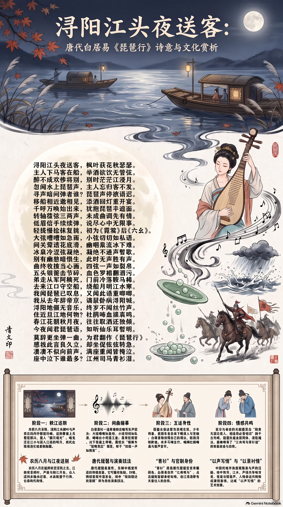

**唐·白居易** · 深秋江夜，听曲感怀

## 诗词全文

浔阳江头夜送客，枫叶荻花秋瑟瑟。
主人下马客在船，举酒欲饮无管弦。
醉不成欢惨将别，别时茫茫江浸月。
忽闻水上琵琶声，主人忘归客不发。
寻声暗问弹者谁？琵琶声停欲语迟。
移船相近邀相见，添酒回灯重开宴。
千呼万唤始出来，犹抱琵琶半遮面。
转轴拨弦三两声，未成曲调先有情。
弦弦掩抑声声思，似诉平生不得志。
低眉信手续续弹，说尽心中无限事。
轻拢慢捻抹复挑，初为《霓裳》后《六幺》。
大弦嘈嘈如急雨，小弦切切如私语。
嘈嘈切切错杂弹，大珠小珠落玉盘。
间关莺语花底滑，幽咽泉流冰下难。
冰泉冷涩弦凝绝，凝绝不通声暂歇。
别有幽愁暗恨生，此时无声胜有声。
银瓶乍破水浆迸，铁骑突出刀枪鸣。
曲终收拨当心画，四弦一声如裂帛。
东船西舫悄无言，唯见江心秋月白。
沉吟放拨插弦中，整顿衣裳起敛容。
自言本是京城女，家在虾蟆陵下住。
十三学得琵琶成，名属教坊第一部。
曲罢曾教善才服，妆成每被秋娘妒。
五陵年少争缠头，一曲红绡不知数。
钿头银篦击节碎，血色罗裙翻酒污。
今年欢笑复明年，秋月春风等闲度。
弟走从军阿姨死，门前冷落鞍马稀。
暮去朝来颜色故，门前冷落鞍马稀。
去来江口守空船，绕船月明江水寒。
夜深忽梦少年事，梦啼妆泪红阑干。
我闻琵琶已叹息，又闻此语重唧唧。
同是天涯沦落人，相逢何必曾相识！
我从去年辞帝京，谪居卧病浔阳城。
浔阳地僻无音乐，终岁不闻丝竹声。
住近湓江地低湿，黄芦苦竹绕宅生。
其间旦暮闻何物？杜鹃啼血猿哀鸣。
春江花朝秋月夜，往往取酒还独倾。
岂无山歌与村笛？呕哑嘲哳难为听。
今夜闻君琵琶语，如听仙乐耳暂明。
莫辞更坐弹一曲，为君翻作《琵琶行》。
感我此言良久立，却坐促弦弦转急。
凄凄不似向前声，满座重闻皆掩泣。
座中泣下谁最多？江州司马青衫湿。

## 赏析

农历八月将尽，秋意正深，最宜读《琵琶行》中“枫叶荻花秋瑟瑟”的江夜。诗从送别无乐、江月迷茫写起，忽然传来琵琶声，清冷的秋景便有了情绪的回响。白居易以急雨、私语、玉盘落珠、冰下泉流、铁骑突围等一连串比喻，写出乐声由舒缓到激越、由停顿到爆发的层次，堪称中国古典文学描写音乐的高峰。诗的动人处又不只在音乐：琵琶女由京城名伎沦为江口孤客，诗人由朝廷官员谪居浔阳，两人的人生境遇在秋江月色中交汇。“同是天涯沦落人，相逢何必曾相识”超越了身份与经历，写出对失意者的体察和同情。结尾“江州司马青衫湿”以克制的自述收束全篇，使个人泪水成为对时代中无数失意人生的共鸣。

## 相关风俗

- 农历八月正值仲秋至深秋之交，江南常见枫叶、芦荻与秋江月色。古人送别多临水设宴，水面既便于行舟，也易烘托离情。
- 唐代琵琶是宴饮、乐舞中极受欢迎的弹拨乐器。它可通过轮指、扫拂、挑拨呈现丰富音色，诗中“轻拢慢捻抹复挑”即为演奏技法。
- “青衫”原是唐代低级官员常服颜色。白居易自称“江州司马”，点出被贬后的身份处境，也让落泪带有失意仕人的自伤。
- 《霓裳羽衣曲》是唐代著名宫廷乐舞，《六幺》则是流行曲调。诗中先后点出两曲，显示琵琶女技艺娴熟，也暗示其昔日繁华。
- 中国传统审美重视“以声写情”与“以景衬情”。诗中秋月、江水、芦荻并非背景装饰，而是与琵琶声、人物命运共同构成凄清意境。

## 背后的故事

> 《琵琶行》最耐人寻味处，不只在一夜江船上的音乐描写，而在白居易自称“恬然自安”两年后，竟被一名失意歌女的身世击中，才真正意识到迁谪之痛。诗前小序保存了事件的时间、地点与对话骨架；长诗则把长安教坊的繁华、商妇的漂泊和江州司马的青衫泪，织成一场跨越阶层的互相照见。

### 作者轶事

- 白居易贬江州，并非寻常外任。元和十年宰相武元衡遇刺，京师震动，他率先上疏，请急捕凶徒以雪国耻；宰相认为他以东宫官身份越职言事，又借其母坠井等旧事加以弹劾，遂出为江州司马。诗中“我从去年辞帝京”，背后正是这种由谏官跌入闲散佐官的急转。 〔史实 · 《旧唐书·卷一百六十六·白居易传》〕
- 白居易在序中坦言，出官两年，原本“恬然自安”；听完歌女自叙，才“始觉有迁谪意”。这句自白很见其人：他并不一开始便以愁苦自居，而是在倾听他人的失意时，忽然照见自己的政治创伤。所谓“同是天涯沦落人”，因而不是泛泛的怜香惜玉，而是失势者之间的身份共振。 〔史实 · 《白氏长庆集·卷十二·琵琶行并序》〕

### 本事与创作背景

- 本诗的本事由小序交代得极具体：元和十一年秋，白居易送客于湓浦口，闻舟中琵琶，听出“京都声”。弹者自称原为长安倡女，曾向穆、曹两位“善才”学艺，年长色衰后嫁与商人。诗人命酒请她再弹，又写成长句相赠；全诗遂是一次夜宴、演奏与诉身世的文学重构。 〔史实 · 《白氏长庆集·卷十二·琵琶行并序》〕
- 序中还特别说此篇“凡六百一十六言，命曰《琵琶行》”。“行”本是乐府歌行体名，容许铺叙人物、对话和场景，不拘近体诗格律。白居易以七言长篇安排两次演奏：前一次写声势与技法，后一次写满座掩泣；歌女的自述与诗人的自述并列，形成如传奇叙事般的双线结构。 〔史实 · 《白氏长庆集·卷十二·琵琶行并序》〕

### 时代背景

- 中唐的江州司马，是州府佐贰官，远离中央权力核心。白居易由京官贬任此职，俸禄、交游与施政空间皆大为缩减；诗中“地僻”“低湿”“终岁不闻丝竹”，既是湓江环境的感受，也是在写被排出长安政治与文化中心后的空落。结尾特举官名而不直书姓名，更显身份的冷清。 〔史实 · 《旧唐书·卷一百六十六·白居易传》〕
- “教坊第一部”透露出唐代都市娱乐业的规模。教坊原为宫廷与官府管理乐舞、培训乐工的机构，而长安名妓、乐伎的技艺与名声也能流入贵族宴饮市场。歌女少时受名师训练、以技压人，后来却因年老色衰、亲属离散而嫁商人，这种从教坊式繁华坠入江湖生计的轨迹，正是诗中繁盛与衰飒的时代反差。 〔史实 · 《唐会要·卷三十四·教坊》〕

### 风土人情

- 秋江送别时“主人下马客在船，举酒欲饮”，可见陆上来客与舟中行人交接的送行方式。湓浦近江，夜航船只停泊，酒席本应配以管弦助兴；偏偏“无管弦”，使枫叶、荻花、江月构成一场缺声的送别。琵琶声从邻舟传来，恰好填补了宴席的空缺，也把普通饯别变为可传诵的夜遇。 〔史实 · 《白氏长庆集·卷十二·琵琶行并序》〕
- “五陵年少争缠头，一曲红绡不知数”中的“缠头”，是以锦帛、钱物等酬谢歌舞伎人的赏赐；“钿头银篦击节碎，血色罗裙翻酒污”，则把豪客宴饮写得近乎挥霍。诗人不抽象议论风尘荣辱，而让一件被击碎的发饰、一袭沾酒的红裙，显出名伎被消费的青春和繁华的残酷。 〔史实 · 《白氏长庆集·卷十二·琵琶行并序》〕

### 典故与名物

- 《霓裳》即《霓裳羽衣曲》，是唐玄宗朝最负盛名的大曲，后来常被视作开元、天宝宫廷乐舞的象征。诗中让歌女先奏《霓裳》，并非只为炫技：一支带着盛唐宫廷记忆的曲子，从长安名伎手中流落到浔阳江船，正与她本人由红极一时到嫁作商人妇的命运相互映照。 〔史实 · 《新唐书·卷二十二·礼乐志十二》〕
- 《六幺》又作《绿腰》，是唐人熟知的琵琶曲名，以节奏变化和高难度指法著称。诗中“轻拢慢捻抹复挑”连列手法，随后由急雨、私语、珠落玉盘写到裂帛，未必是逐拍记录，却抓住琵琶由细密、凝涩而骤然爆发的听觉层次。它使抽象乐声获得可见、可触的物象。 〔史实 · 《乐府杂录·琵琶》〕
- “江州司马青衫湿”的“青衫”并不只是颜色。唐代舆服以服色区分品秩，低阶官员服青；白居易在篇末以官名和服色自称，故意不用“白居易”三字，把个人眼泪安放进一件低品官服里。青衫既承接贬谪后的身份，亦成为后世“青衫泪”一语的情感标记。 〔史实 · 《新唐书·卷二十四·车服志》〕
