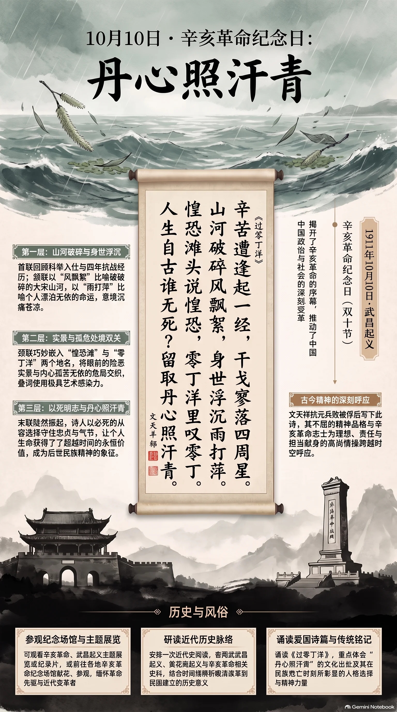

**南宋·文天祥** · 辛亥革命纪念日（武昌起义纪念日、双十节）

## 诗词全文

辛苦遭逢起一经，干戈寥落四周星。
山河破碎风飘絮，身世浮沉雨打萍。
惶恐滩头说惶恐，零丁洋里叹零丁。
人生自古谁无死？留取丹心照汗青。

## 赏析

10月10日是辛亥革命武昌起义纪念日，亦称“双十节”。1911年这一天的枪声揭开了辛亥革命的序幕，推动了中国政治与社会的深刻变革。选择南宋文天祥《过零丁洋》，并非因诗作与武昌起义有直接年代关联，而是因为它所凝聚的家国情怀、民族气节，与纪念辛亥志士为理想献身的精神形成深切呼应。

此诗作于文天祥抗元兵败、被俘后。首联回顾自己由科举入仕、投身战乱的经历；颔联以“风飘絮”“雨打萍”比喻破碎山河与漂泊身世，形象沉痛。颈联巧妙嵌入惶恐滩、零丁洋两个地名，又反复点出“惶恐”“零丁”，使眼前实景与内心孤危交织。末联陡然振起：“人生自古谁无死？留取丹心照汗青。”诗人以必死的从容选择守住忠贞，令个人生命获得超越时间的价值。它提醒人们，纪念历史不仅是回望变革，更要珍视理想、责任与担当。

## 相关风俗

- 可观看辛亥革命、武昌起义主题展览或纪录片，结合时间线了解晚清改革、革命起义与民国建立的历史脉络。
- 许多地方会举行纪念座谈、献花或参观辛亥革命纪念场馆等活动，表达对革命先驱及近代变革者的缅怀。
- 适合诵读《过零丁洋》，重点体会“丹心照汗青”的出处及文天祥在民族危亡中的人格选择。
- 可安排一次近代史阅读，如查阅武昌起义、黄花岗起义与辛亥革命相关史料，辨析纪念日背后的历史意义。

## 背后的故事

> 《过零丁洋》最有力的本事，并非泛指“临死不屈”，而是文天祥被元军拘执、随船经过珠江口外零丁洋时，元将张弘范要他写信招降仍在海上的宋军。他没有写劝降书，却交出这首诗。末二句因此不是事后塑成的碑文，而是在南宋最后海战前夕，对敌手作出的当面回答。

### 作者轶事

- 文天祥并非一开始便以“忠烈”形象出现。宝祐四年廷试，他所上万余言策论锋芒甚健，宋理宗亲擢第一。后来诗中“辛苦遭逢起一经”，便把这次由经术、科举进入仕途的经历压缩成一句：一个相信朝廷秩序可以施展抱负的青年，最终却看见这套秩序在战火中瓦解。 〔史实 · 《宋史·卷四百一十八·文天祥传》〕
- 德祐元年元军南下，文天祥在赣州起兵勤王，散家财募士，仓促组成的队伍多是乡里子弟与义勇。传记特意写他“尽以家赀为军费”，这使“辛苦遭逢”不只是读书应试的辛苦，也包括一位地方士大夫把家业、宗族和私人生活一并押进残局的代价。 〔史实 · 《宋史·卷四百一十八·文天祥传》〕

### 本事与创作背景

- 文天祥于祥兴元年十二月在五坡岭兵败被执，次年被押至潮阳一带，与元军主将张弘范相见。当时崖山宋军仍由张世杰统率海上坚持，张弘范希望借文天祥的名望招降。所谓“过零丁洋”，正是囚徒随元军舟师行经海面的题咏；海上风浪与政治上的孤危在诗中重叠。 〔史实 · 《宋史·卷四百一十八·文天祥传》〕
- 张弘范索要招降张世杰的书信，文天祥没有直接作书，而把所作《过零丁洋》交给他。史传特别录出“人生自古谁无死，留取丹心照汗青”二句，说明它在早期叙事中即被当作拒降的答复，而非后来从众多诗句中任意挑出的格言。写作时，崖山决战尚未发生，结局却已近在眼前。 〔史实 · 《宋史·卷四百一十八·文天祥传》〕

### 时代背景

- 诗中的“山河破碎”有极具体的制度背景。德祐二年，临安降元，宋恭帝北迁；但南方仍先后拥立端宗、卫王，形成流亡朝廷与海上军政集团。文天祥不是为一个已经稳固存在的国家而战，而是在中央覆灭、地方义军各自为战的条件下维持“宋”的名义，因此格外显出“寥落”二字的冷清。 〔史实 · 《宋史·卷四十七·瀛国公纪》〕
- 南宋末年“勤王”并不只是朝臣的口号。地方官、宗族、豪强、流亡军民都可能以保乡里、保故国的名义聚兵，然而粮饷、舟楫和号令难以统一。文天祥部众屡败屡集，正是这种战时动员的缩影。诗里“身世浮沉雨打萍”既写个人囚途，也写士人脱离稳定官僚网络后如浮萍般被战局推卷。 〔史实 · 《宋史·卷四百一十八·文天祥传》〕

### 风土人情

- 若置于双十节朗诵，应点明这是一层后设的纪念语境。辛亥革命武昌起义发生在1911年10月10日，后世称“双十”；中华人民共和国的法定纪念日体系中亦列有辛亥革命纪念日。文天祥与辛亥革命相隔六百余年，二者并无历史关联；可相接的，是后世常以“国破而不改其志”的伦理语言纪念政权更替与民族危亡。 〔史实 · 《全国年节及纪念日放假办法·第三条》〕
- 南宋末年的江海交通具有双重面貌：赣江水路可通岭南，珠江口外又是连接广州、潮阳及崖山的海上走廊；和平时它输送盐、米、商货，战时则成为转运军队、押解俘虏和追逐流亡朝廷的航道。文天祥把惶恐滩、零丁洋两处水域并置，正利用了舟行者对险滩、潮汐、风浪的切身恐惧。 〔史实 · 《宋史·卷四百一十八·文天祥传》〕

### 典故与名物

- “起一经”不是说文天祥只读过一部经书，而是以汉唐以来的经术取士传统概括自己的进身道路。“经”指儒家经典；宋代科举虽重策论、诗赋与经义，士人仍以通经为正途。此句故意用极朴素的履历起笔：从书卷和考场起家的人，后来却不得不以兵戈与死亡来证明其政治信念。 〔史实 · 《宋史·卷一百五十五·选举志一》〕
- “干戈寥落四周星”的“周星”关涉古人以岁星纪年的天文观念。岁星约十二年行一周天，“周星”遂可借指岁月流转；在本诗语境中，通常指自德祐元年起兵至被执前后的四年。它不是从容的年表语言，而是回望中发现：原以为短暂的勤王行动，竟已在败走、募兵、渡江之间拖成数年。 〔史实 · 《宋史·卷四百一十八·文天祥传》〕
- “汗青”原指竹简制作时以火烘烤、使水分渗出的工序，称为“杀青”；竹简由此可代指史书。文天祥说“丹心照汗青”，并非期待个人姓名被普通记载，而是要让赤诚与历史记录彼此映照。这里的“照”有光照、昭示之意，把原本冷硬的竹简想象成能够辨白忠奸的见证者。 〔史实 · 《后汉书·卷六十四·吴祐传》〕
